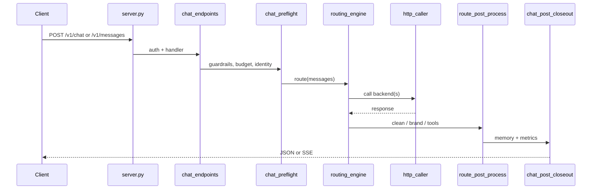

# Request Pipeline Authority (REF-005)

Date: 2026-05-25 (expanded CQ-087)

## Decision

Production LiMa chat requests use an **explicit, layered pipeline**. No single
`factory.build_default_pipeline()` owns the live path.

Authority order:

1. **Edge** — `server.py`, `http_body_limit.BodySizeLimitMiddleware`, `access_guard`
2. **Protocol routes** — `routes/chat_endpoints.py`, `routes/anthropic_messages_handler.py`, `routes/tool_forward*.py`
3. **Preflight** — `routes/chat_preflight.py`, `server_context.py`, optional `context_pipeline.guardrails`
4. **Routing** — `routing_engine.route()` / `pick_backend()`（选路 + 执行；`select`/`execute` 分别在 `routing_selector` / `routing_executor`）
5. **HTTP transport** — `http_caller` → `http_sync` / `http_async` / `http_stream`
6. **Post-process** — `route_post_process.py`, `response_cleaner.py`, `identity_guard.py`
7. **Closeout** — `routes/chat_post_closeout.py` (memory, observability, distill queue)

`context_pipeline.factory.build_default_pipeline()` remains a **lab/test harness**
for IDE/scenario/prompt experiments. Production adopts pieces only after focused
tests and VPS smoke (retrieval unification pattern, CQ-059).

## Module ownership matrix

| Concern | Authoritative module | Legacy / compat facade | Notes |
|--------|----------------------|-------------------------|-------|
| Backend registry | `backends_registry.py` + `backends_constants.py` | `backends.py` re-exports | Detection helpers live in facade |
| Intent + tier classify | `routing_classifier.py` | `smart_router.classify` | `classify()` → request_type; `classify_scenario()` → scenario |
| Backend pool definition | `router_v3.py` | — | `POOLS` dict; `select_backends()` returns candidates by request_type |
| Backend ranking | `routing_selector.py` | — | `select()`综合 health/budget/sticky/ML/memory/评分 |
| Backend execution | `routing_executor.py` | — | `execute()`按序/并行尝试，记录 health 成功/失败 |
| HTTP transport | `http_caller.py` | `router_http.py` (urllib) | Migrate callers to httpx stack |
| Health / cooldown | `health_tracker.py` | `router_circuit_breaker.py` | Prefer health_tracker for new code |
| Budget management | `budget_manager.py` | — | `is_budget_available` + `record_usage` |
| Sticky session | `sticky_session.py` | — | `pin_backend` / `get_pinned_backend` |
| Route scoring | `route_scorer.py` | — | 质量/稳定性/延迟/任务适配评分 |
| Stream bridge | `streaming.py`, `routes/stream_handlers.py` | `routes/anthropic_stream.py` | Tool-native vs simulated SSE |
| Retrieval inject | `context_pipeline/retrieval_injection.py` | `local_retrieval` | 知识图谱/向量检索 |
| Code context inject | `context_pipeline/code_context_injection.py` | — | tree-sitter 扫描 |
| Skills inject | `skills_injector.py` | — | Temperature-gated |
| Session memory write | `session_memory/store*.py` | — | Split: db/crud/promote/admin |
| Quality retry | `routes/quality_gate*.py` | root `quality_gate.py` (coding eval) | **Different modules** |
| Response validation | `context_pipeline/response_validator.py` | — | 编码响应质量检查 |
| Post-route hooks | `route_post_process.py` | — | correlation/evidence/feedback |
| Agent task HTTP | `routes/agent_tasks.py` | store/service/schemas submodules | Not on chat hot path |
| Agent run queue | `agent_runtime/orchestrator*.py` | `orchestrator.py` facade | Local lease queue |
| Ops metrics | `routes/ops_metrics.py` | — | Reads `app.state.stats` |

## routing_engine.route() 内部管线

`routing_engine.route()` 是唯一路由入口，内部按序执行：

> **已知 bypass 收敛与流式一致性：** 见 [`docs/superpowers/plans/2026-06-13-routing-authority-bypass-audit.md`](superpowers/plans/2026-06-13-routing-authority-bypass-audit.md)。流式 speculative 选路使用 `pick_backend()`（与 `route()` 共享前半段），不经 `select()`/`execute()` 直调。

```text
1. identity_guard    — 身份识别短路 (→ 直接返回)
2. classify          — request_type (ide/chat/code/image)
3. classify_scenario — scenario (coding/chat/device/...)
4. skill_store       — 技能记忆召回 → recalled_backend
5. retrieval_injection — 知识图谱/向量上下文注入
6. code_context      — (coding only) tree-sitter 代码上下文
7. memory_promote    — (coding only) 历史 coding_fact/routing_lesson
8. complexity        — 请求复杂度评估
9. router_v3.select_backends → routing_selector.select — 后端排名
10. skills_injector  — Skills 注入到 messages
11. context_compressor — (可选) 长对话压缩
12. speculative      — (简单请求) 推测性并行调用
13. routing_executor.execute — 按序/并行执行 + fallback
14. response_validator — (coding) 响应质量验证 + 重试
15. route_post_process — 后处理 (correlation/evidence/feedback)
16. feedback_bridge  — 闭环反馈记录
```

**流式 speculative（非完整 route）：** `routes/stream_handlers.speculative_stream_chunks` → `v3_predict` / `v3_select` → `pick_backend()` → `v3_call_stream*` 执行 HTTP。

**Eval 固定 backend（非 chat route）：** `POST /internal/v1/eval/call` 与 `eval_call.make_eval_call_fn()` 经 `eval_pinned_call.call_pinned_backend()` → `routing_executor.execute([backend], …)` → `http_caller`；不走 classify/select，但记录 health/budget。

## 流式 vs 非流式路由 parity（刻意差异，Phase 4-B）

**结论：** 生产 chat **不要求**流式与非流式走同一套 `route()` 后半段。Speculative 流式为 **首 token 延迟** tradeoff；非流式为 **完整 fallback + 质量 + 闭环** tradeoff。

### 入口对照

| 场景 | 入口 | 选路 | HTTP 执行 |
|------|------|------|-----------|
| 非流式 chat | `v3_route` → `routing_engine.route()` | `pick_backend()` + `execute_with_strategy()` | `routing_executor.execute()` → `http_caller` |
| 流式 chat（默认热路径） | `stream_response` → `speculative_stream_chunks` | `v3_predict` / `v3_select` → `pick_backend()` | `v3_call_stream*` → **`http_caller` 直调**（不经 `routing_executor`） |
| 流式 fallback | `stream_response` → `_authoritative_route` | 完整 `route()` | `routing_executor.execute()` |
| thinking / orchestration 流式 | 先 `thinking_route` 或 `orchestrate`，否则 `_authoritative_route` | 完整 `route()` 或多步编排 | 同上 fallback 列 |
| Eval 固定 backend | `eval_pinned_call` | 无 classify/select | `routing_executor.execute([backend])` |

### `pick_backend()` 共享 vs `route()` 独占

两者 **共享**（流式 speculative 与非流式均覆盖）：

- `classify` / `classify_scenario`
- `skill_store` 召回、`retrieval_injection`、`code_context`（coding）
- `routing_selector.select`（含 sticky / prefer / budget 过滤）
- `skills_injector`、`context_compressor`

仅 **`route()` 非流式路径** 覆盖：

| 步骤 | 模块 | 流式 speculative 是否执行 | 说明 |
|------|------|---------------------------|------|
| identity 短路 | `identity_guard` | ❌ | 流式热路径未调用；失败时 fallback 到 `v3_route` 可覆盖 |
| 执行策略 | `routing_engine_execute_strategy` | ❌ | 无 speculative 并行 winner、code affinity 合并 |
| 多 backend fallback | `routing_executor.execute` | ❌ | 流式仅单 backend 流；失败靠 `bridge_stream` 内 API fallback 或 `_authoritative_route` |
| coding 质量重试 | `response_validator` | ❌ | 仅 `route()` 内 `_maybe_quality_retry` |
| 路由后闭环 | `routing_engine_post.post_route` | ❌ | 无 `route_post_process` / `feedback_bridge` / `routing_decision` 事件 |
| sticky pin | `sticky_session.pin_backend` | ❌ | 仅在 `execute_with_strategy` 成功路径 |

流式 **额外** 行为（非 `route()` 对称）：

- `streaming.speculative_stream`：predict 后立即开流，后台 `select` 校验并可切换 backend
- `v3_call_stream*`：coding 场景在 adapter 内补 `lima_context` / `think_plan`（与 `pick_backend` 注入并行存在，非重复 `route()`）
- `response_cleaner.clean_response`：按 chunk 清洗（非流式在 `finalize_success_response` 整段清洗）

### Closeout（handler 层）

| 能力 | 非流式 | 流式 speculative |
|------|--------|------------------|
| `chat_post_closeout`（memory / metrics / distill） | ✅ `chat_response_finalize.finalize_success_response` | ⚠️ 热路径未统一 closeout；依赖 handler 外层或 fallback 路径 |
| `route_post_process` | ✅ 经 `post_route` | ❌ 热路径跳过 |

### 设计原则（非 bug backlog）

1. **权威 = 无 bypass `routing_engine.select/execute` 从 routes 直调** — 已收敛；流式经 `pick_backend` + `http_caller` 是 **documented exception**。
2. **parity 目标** — 选路输入（classify / prefer / sticky）一致；执行与后处理 **允许不对称**。
3. **未来可选** — `route_stream()` facade（共享 executor + 可选 post_route）仅在需要统一 fallback/feedback 时再做；当前不阻塞 Phase 4 验收。

**守护测试：** `tests/test_routing_pipeline_authority.py`（bypass guard）、`tests/test_prefer_model_routing.py`（prefer 流式/非流式选路一致）。

## Request flow (chat)



## What not to use for new production code

| Module | Status |
|--------|--------|
| `smart_router.py` chat path | Legacy. 保留 warmup/distill/ROUTE 兼容；新请求走 `routing_engine.route()` |
| `router_http.py` direct calls | Legacy urllib path; use `http_caller` |
| `v3_integration.py` | Dead; superseded by `routing_engine` |
| `fallback_chain.py` | Unreferenced |
| `context_pipeline.factory` as sole pipeline | Lab only |
| `deploy/key_rotation.py` | Retired (archive in `scripts/archive/`) |

## Tests that guard authority

- `tests/test_routing_engine.py` — layer behavior
- `tests/test_production_retrieval.py` — retrieval on live path
- `tests/test_route_post_process.py` — post-route hooks
- `tests/test_http_caller.py` — transport
- `tests/test_request_context_preflight.py` — preflight contracts
- `tests/test_request_pipeline_authority.py` — module ownership matrix (CQ-095)

## When to revisit full factory authority

- `server.py` remains thin and all route modules register via `route_registry` only
- Parity tests: factory stages vs production trace for `/v1/messages` and `/v1/chat/completions`
- CTX-003 preflight needs one composable pipeline with measurable token budget

## Related docs

- `docs/ROUTING_ENGINE_DESIGN.md`
- `docs/CODE_QUALITY_IMPROVEMENT_PLAN_2026-05-25.md`
- `docs/CONTEXT_PIPELINE.md` (lab pipeline)
