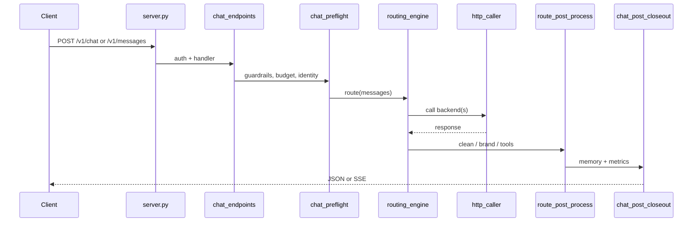

# Request Pipeline Authority (REF-005)

Date: 2026-05-25 (expanded CQ-087)

## Decision

Production LiMa chat requests use an **explicit, layered pipeline**. No single
`factory.build_default_pipeline()` owns the live path.

Authority order:

1. **Edge** — `server.py`, `http_body_limit.BodySizeLimitMiddleware`, `access_guard`
2. **Protocol routes** — `routes/chat_endpoints.py`, `routes/anthropic_messages_handler.py`, `routes/tool_forward*.py`
3. **Preflight** — `routes/chat_preflight.py`, `server_context.py`, optional `context_pipeline.guardrails`
4. **Routing** — `routing_engine.route()` (authoritative for backend selection + execution)
5. **HTTP transport** — `http_caller` → `http_sync` / `http_async` / `http_stream`
6. **Post-process** — `route_post_process.py`, `response_cleaner.py`, `identity_guard.py`
7. **Closeout** — `routes/chat_post_closeout.py` (memory, observability, distill queue)

`context_pipeline.factory.build_default_pipeline()` remains a **lab/test harness**
for IDE/scenario/prompt experiments. Production adopts pieces only after focused
tests and VPS smoke (retrieval unification pattern, CQ-059).

## Module ownership matrix

| Concern | Authoritative module | Legacy / compat facade | Notes |
|--------|----------------------|-------------------------|-------|
| Backend registry | `backends_registry.py` + `backends_constants.py` | `backends.py` re-exports | Detection helpers live in facade |
| Intent + tier classify | `routing_engine.py` | `smart_router.classify` | `smart_router` delegates or mirrors |
| Backend select + fallback | `routing_engine.py` | `router_v3.py` | P2C/sticky in `router_v3` / `sticky_session.py` |
| Health / cooldown | `health_tracker.py` | `router_circuit_breaker.py` | Prefer health_tracker for new code |
| Sync/async HTTP call | `http_caller.py` | `router_http.py` (urllib) | Migrate callers to httpx stack |
| Stream bridge | `streaming.py`, `routes/stream_handlers.py` | `routes/anthropic_stream.py` | Tool-native vs simulated SSE |
| Retrieval inject | `routing_engine` + `local_retrieval` | `v3_adapters.py` slices | Evidence: `test_production_retrieval.py` |
| Skills inject | `skills_injector.py` | — | Temperature-gated |
| Semantic cache | `semantic_cache.py` | — | temperature=0 only |
| Session memory write | `session_memory/store*.py` | — | Split: db/crud/promote/admin |
| Quality retry | `routes/quality_gate*.py` | root `quality_gate.py` (coding eval) | **Different modules** |
| Agent task HTTP | `routes/agent_tasks.py` | store/service/schemas submodules | Not on chat hot path |
| Agent run queue | `agent_runtime/orchestrator*.py` | `orchestrator.py` facade | Local lease queue |
| Budget | `budget_manager.py` | — | Wired from routing_engine |
| Ops metrics | `routes/ops_metrics.py` | — | Reads `app.state.stats` |

## Request flow (chat)

## What not to use for new production code

| Module | Status |
|--------|--------|
| `router_http.py` direct calls | Legacy urllib path; use `http_caller` |
| `v3_integration.py` | Dead; superseded by `routing_engine` |
| `fallback_chain.py` | Unreferenced |
| `context_pipeline.factory` as sole pipeline | Lab only |
| `deploy/key_rotation.py` | Retired (archive in `scripts/archive/`) |

## Tests that guard authority

- `tests/test_routing_engine.py` — layer behavior
- `tests/test_production_retrieval.py` — retrieval on live path
- `tests/test_route_post_process.py` — post-route hooks
- `tests/test_http_caller.py` — transport
- `tests/test_request_context_preflight.py` — preflight contracts

## When to revisit full factory authority

- `server.py` remains thin and all route modules register via `route_registry` only
- Parity tests: factory stages vs production trace for `/v1/messages` and `/v1/chat/completions`
- CTX-003 preflight needs one composable pipeline with measurable token budget

## Related docs

- `docs/ROUTING_ENGINE_DESIGN.md`
- `docs/CODE_QUALITY_IMPROVEMENT_PLAN_2026-05-25.md`
- `docs/CONTEXT_PIPELINE.md` (lab pipeline)
