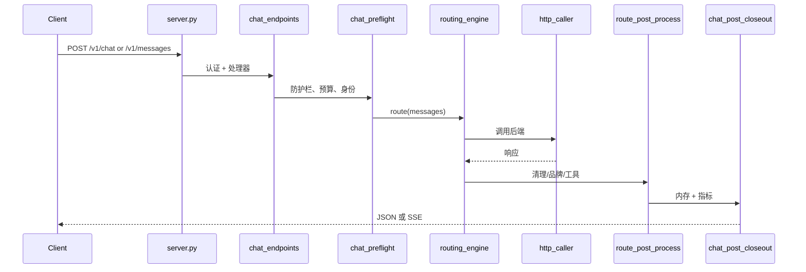

# 请求管道权威文档 (REF-005)

日期: 2026-05-25 (扩展 CQ-087)

## 决策

生产环境的 LiMa 聊天请求使用**显式、分层的管道**。没有单一的
`factory.build_default_pipeline()` 拥有实时路径。

权威顺序：

1. **边缘** — `server.py`, `http_body_limit.BodySizeLimitMiddleware`, `access_guard`
2. **协议路由** — `routes/chat_endpoints.py`, `routes/chat_handler_dispatch.py`
3. **预检** — `routes/chat_preflight.py`, `server_context.py`, 可选 `context_pipeline.guardrails`
4. **路由** — `routing_engine.route()` (后端选择 + 执行的权威)
5. **HTTP 传输** — `http_caller` → `http_sync` / `http_async` / `http_stream`
6. **后处理** — `route_post_process.py`, `response_cleaner.py`, `identity_guard.py`
7. **关闭** — `routes/chat_post_closeout.py` (内存、可观测性、蒸馏队列)

`context_pipeline.factory.build_default_pipeline()` 仍然是**实验室/测试工具**
用于 IDE/场景/提示实验。生产环境仅在专注测试和 VPS 冒烟后采用部分组件 (检索统一模式, CQ-059)。

## 模块职责矩阵

| 关注点 | 权威模块 | 遗留/兼容外观 | 备注 |
|--------|----------|---------------|------|
| 后端注册 | `backends_registry.py` + `backends_constants.py` | `backends.py` 重导出 | 检测助手位于 `backend_utils.py` |
| 意图分析 | `routing_intent.py` | — | `analyze_intent()` 统一意图分类 |
| 场景分类 | `routing_classifier.py` | — | `classify()` → request_type; `classify_scenario()` → scenario |
| 后端池定义 | `router_v3/` 包 | — | `POOLS` 字典在 `router_v3/pools.py`; `select_backends()` 按 request_type 返回候选 |
| 后端排名 | `routing_selector/` 包 | — | `select()` 在 `routing_selector/core.py`；综合 health/budget/sticky/ML/memory/评分 |
| 后端执行 | `routing_executor.py` | — | `execute()`按序/并行尝试，记录 health 成功/失败 |
| HTTP 传输 | `http_caller.py` (→ `http_sync`/`http_async`/`http_stream`) | — | httpx 栈，已无 urllib 遗留 |
| 健康/冷却 | `health_tracker.py` | — | 新代码优先使用 health_tracker |
| 预算管理 | `budget_manager.py` | — | `is_budget_available` + `record_usage` |
| 粘性会话 | `sticky_session.py` | — | `pin_backend` / `get_pinned_backend` |
| 路由评分 | `route_scorer.py` | — | 质量/稳定性/延迟/任务适配评分 |
| 流桥接 | `streaming.py`, `routes/stream_handlers.py` | — | 工具原生 vs 模拟 SSE |
| 检索注入 | `context_pipeline/retrieval_injection.py` | `local_retrieval` | 知识图谱/向量检索 |
| 代码上下文注入 | `context_pipeline/code_context_injection.py` | — | tree-sitter 扫描 |
| 技能注入 | `skills_injector.py` | — | 温度门控 |
| 会话内存写入 | `session_memory/store*.py` | — | 拆分: db/crud/promote/admin |
| 响应验证 | `context_pipeline/response_validator.py` | — | 编码响应质量检查 |
| 路由后钩子 | `route_post_process.py` | — | 关联/证据/反馈 |
| 代理任务 HTTP | `routes/agent_tasks.py` | store/service/schemas 子模块 | 不在聊天热路径上 |
| 运维指标 | `routes/ops_metrics.py` | — | 读取 `app.state.stats` |

## routing_engine.route() 内部管线

`routing_engine.route()` 是唯一路由入口，内部按序执行：

> **已知 bypass 收敛：** 见 [`docs/superpowers/plans/2026-06-13-routing-authority-bypass-audit.md`](superpowers/plans/2026-06-13-routing-authority-bypass-audit.md)

```text
1. identity_guard    — 身份识别短路 (→ 直接返回)
2. classify          — request_type (ide/chat/code/image)
3. classify_scenario — scenario (coding/chat/device/...)
4. skill_store       — 技能记忆召回 → recalled_backend
5. retrieval_injection — 知识图谱/向量上下文注入
6. code_context      — (coding only) tree-sitter 代码上下文
7. memory_promote    — (coding only) 历史 coding_fact/routing_lesson
8. complexity        — 请求复杂度评估
9. router_v3.select_backends → routing_selector.select — 后端排名
10. skills_injector  — Skills 注入到 messages
11. context_compressor — (可选) 长对话压缩
12. speculative      — (简单请求) 推测性并行调用
13. routing_executor.execute — 按序/并行执行 + fallback
14. response_validator — (coding) 响应质量验证 + 重试
15. route_post_process — 后处理 (correlation/evidence/feedback)
16. feedback_bridge  — 闭环反馈记录
```

**流式 speculative：** `pick_backend()` 共享选路前半段，经 `v3_call_stream*` 执行 HTTP。

## 请求流程 (聊天)



## 新生产代码不应使用的模块

| 模块 | 状态 |
|------|------|
| `context_pipeline.factory` 作为唯一管道 | 仅限实验室/测试工具 |

## 保护权威的测试

- `tests/test_routing_engine.py` — 层行为
- `tests/test_production_retrieval.py` — 实时路径上的检索
- `tests/test_route_post_process.py` — 路由后钩子
- `tests/test_http_caller.py` — 传输
- `tests/test_request_context_preflight.py` — 预检契约
- `tests/test_request_pipeline_authority.py` — 模块职责矩阵 (CQ-095)

## 何时重新审视完整工厂权威

- `server.py` 保持精简，所有路由模块仅通过 `route_registry` 注册
- 对等测试：工厂阶段 vs 生产跟踪 用于 `/v1/messages` 和 `/v1/chat/completions`
- CTX-003 预检需要一个可组合的管道，具有可测量的令牌预算

## 相关文档

- `docs/ROUTING_ENGINE_DESIGN.md`
- `docs/CODE_QUALITY_IMPROVEMENT_PLAN_2026-05-25.md`
- `docs/CONTEXT_PIPELINE.md` (实验室管道)