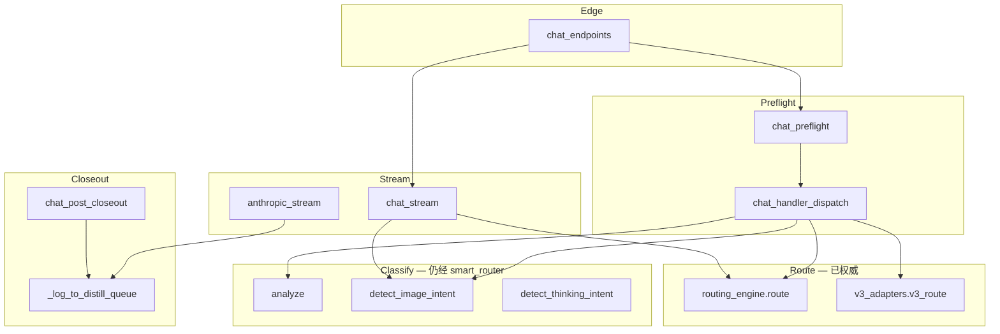

# smart_router 调用方清单与热路径迁移顺序

> Date: 2026-06-05  
> 权威路由：`routing_engine.route()` · 权威 HTTP：`http_caller`  
> 门面（渐进入口）：`routing_facade.py`  
> 状态快照：生产代码 **0 处** 热路径 `import smart_router`（仅 `smart_router.py` 兼容壳 + 测试/脚本）

## 原则

1. **不改行为**：每 slice 只换 import 目标，pytest + IDE golden path 必须通过。
2. **热路径优先**：`/v1/chat/completions`、Anthropic stream、quality fallback 先于 admin/脚本。
3. **smart_router 保留为兼容壳**：extract 模块已存在（`router_classifier`、`router_http` 等）；最终 smart_router 仅 re-export + 本地 router 模型 warmup。
4. **禁止新调用方**：新代码只 import `routing_engine` / `http_caller` / `routing_facade` / 已拆分 `router_*` 模块。

---

## 调用方总览

| 热度 | 文件 | 使用的 smart_router API | 目标替换 | 状态 |
|:---:|------|-------------------------|----------|:----:|
| 🔴 | `routes/chat_handler_dispatch.py` | `analyze`, `detect_image_intent`, `detect_thinking_intent` | `routing_facade` → `router_classifier` / `router_image` / `router_intent` | 待迁 |
| 🔴 | `routes/chat_stream.py` | `detect_image_intent` | `router_image.detect_image_intent` | 待迁 |
| 🔴 | `routes/anthropic_stream.py` | `detect_image_intent`, `_log_to_distill_queue` | `router_image` + `distill_queue`（待抽） | 待迁 |
| 🔴 | `routes/anthropic_stream_branches.py` | `analyze`, `detect_thinking_intent` | `router_classifier` + `router_intent` | 待迁 |
| 🔴 | `routes/chat_support.py` | `call_api`, `BACKENDS`, `THINKING_BACKENDS`, `cb_*`, `DISTILL_QUEUE_DIR`, `DEBUG` | `http_caller` + `backends` + `router_circuit_breaker` + `distill_queue` | 待迁 |
| 🔴 | `routes/quality_gate.py` | `BACKENDS`, `cb_allow`, `cb_record`, `call_api` | `backends` + `router_circuit_breaker` + `http_caller` | 待迁 |
| 🟡 | `routes/chat_post_closeout.py` | `_log_to_distill_queue` | `distill_queue.log_to_distill_queue`（待抽） | 待迁 |
| ✅ | `orchestrate.py` | `analyze`, `call_local` | `router_classifier` + `local_router` + `routing_engine` | **Slice 4 done** |
| ✅ | `server.py` | `warmup_router_model` | `local_router.warmup_router_model` | **Slice 4 done** |
| ✅ | `routes/admin_backends.py` | `BACKENDS` | `backends.BACKENDS` | Slice 4 done |
| ✅ | `routing_facade.py` | `ROUTE`, `PUBLIC_MODEL_NAME` | `routing_constants.py` | **Slice 5 done** |
| ⚪ | `scripts/validate_via_router.py` | `call_api`, `BACKENDS` | 运维脚本，低优先级 | 待迁 |
| ⚪ | `scripts/test_route_e2e.py` | `route`, `ONEAPI_ENABLED` | 遗留 e2e，可归档 | 待归档 |
| ⚪ | `scripts/archive/key_rotation_legacy.py` | 注释引用 | 无 | — |

**已迁移（勿回退）**

| 文件 | 说明 |
|------|------|
| `routes/system_endpoints.py` | `/v1/status` → `routing_facade.router_status_payload()` |
| `routes/v3_adapters.py` | 主路由 `routing_engine`；coder 池 → `routing_facade.ide_coder_pool()` |
| `router_http.py` | 默认委托 `http_caller`（`LIMA_ROUTER_HTTP_HTTPX=1`） |

**测试文件**（迁移完成后统一改 monkeypatch 目标，不阻塞生产 slice）

`test_chat_ide_golden_path.py`, `test_prompt_memory_recall.py`, `test_stream_footer.py`, `test_fallback_context.py`, `test_backend_registry.py`, `test_router_classifier.py`, `test_router_image.py`, `test_vision_routing.py`

---

## 热路径请求流（迁移锚点）



**Slice 1–2 完成后**，Classify 与 Thinking shortcut 不再经过 `smart_router` 包名。

---

## 推荐迁移顺序（6 slices）

### Slice 1 — 分类/意图门面（最低风险，1 PR）

**目标**：chat 热路径上的 `analyze` / `detect_*` 改走 `routing_facade` 或直接 `router_*`。

| 动作 | 文件 |
|------|------|
| 在 `routing_facade.py` 增加薄封装 | `analyze`, `detect_image_intent`, `detect_thinking_intent`, `get_thinking_backend` |
| 替换 import | `chat_handler_dispatch`, `chat_stream`, `anthropic_stream`, `anthropic_stream_branches` |

**门禁**：`pytest tests/test_chat_ide_golden_path.py tests/test_router_classifier.py tests/test_router_image.py -q`

---

### Slice 2 — HTTP 与熔断（thinking + quality gate，1 PR）

**目标**：`call_api` / `cb_*` 统一为 `http_caller` + `router_circuit_breaker`（或 `health_tracker`）。

| 动作 | 文件 |
|------|------|
| `thinking_route` 改用 `http_caller.call_api` | `routes/chat_support.py` |
| `try_backend` 改用 `http_caller` | `routes/quality_gate.py` |
| `BACKENDS` → `from backends import BACKENDS` | 同上 + `chat_support` |

**门禁**：`pytest tests/test_quality_gate*.py tests/test_http_caller*.py -q`

---

### Slice 3 — Distill 队列抽离（1 PR）

**目标**：`_log_to_distill_queue` / `DISTILL_QUEUE_DIR` / `log_sys_prompt` 不再依赖 smart_router。

| 动作 | 说明 |
|------|------|
| 新建 `distill_queue.py` | 从 `smart_router.py` L155–228 平移，无逻辑变更 |
| 替换调用方 | `chat_post_closeout`, `anthropic_stream`, `chat_support.log_sys_prompt` |
| smart_router 保留 re-export | 兼容旧 import 一个版本 |

**门禁**：distill 相关测试（若有）+ chat closeout smoke

---

### Slice 4 — Orchestrate 与 admin（1 PR）

| 动作 | 文件 |
|------|------|
| `orchestrate()` 主路径 → `routing_engine.route` | `orchestrate.py` |
| `call_local` 保留或隔离到 `local_router.py` | 评估是否仍启用 `LIMA_ROUTER_MODEL` |
| `BACKENDS` 直读 registry | `routes/admin_backends.py` |

**门禁**：`pytest tests/test_orchestrate*.py -q`（如有）

---

### Slice 5 — 常量与 status（1 PR）

| 动作 | 说明 |
|------|------|
| `ROUTE` / `PUBLIC_MODEL_NAME` → `routing_constants.py` | `routing_facade.router_status_payload` 读新模块 |
| 删除 `routing_facade` 内 `import smart_router` | status 端点零 legacy import |

**门禁**：`pytest tests/test_routing_facade.py tests/test_system_endpoints*.py -q`

---

### Slice 6 — 兼容壳收尾 ✅

- `smart_router.py` 瘦身为纯 re-export（无 `_log_to_distill_queue` 重复实现）
- 模块 docstring 标记 **DEPRECATED**
- `tests/test_ci_gates.py::test_no_smart_router_imports_in_production` 禁止生产路径新引用

---

## routing_facade 目标 API（Slice 1 待补）

```python
# routing_facade.py — 规划中的薄封装（实现 Slice 1 时添加）
from router_classifier import analyze
from router_image import detect_image_intent
from router_intent import detect_thinking_intent, get_thinking_backend

# 已有：
# router_status_payload()
# ide_coder_pool()
```

---

## 与 router_v3 的关系

| 模块 | 角色 |
|------|------|
| `routing_engine.py` | **生产权威** — select + execute + inject |
| `router_v3.py` | P2C / sticky / 部分 pool 常量；逐步只保留 sticky 相关 |
| `smart_router.py` | **DEPRECATED 兼容壳** — 仅 re-export，禁止生产新引用 |

新功能：**禁止** 再向 `router_v3` 或 `smart_router.route()` 添加分支。

---

## 验证清单（每个 slice 合并前）

```powershell
python -m pytest tests/test_chat_ide_golden_path.py tests/test_routing_facade.py tests/test_routing_engine.py -q --tb=short
python -m pytest tests/test_opencode_e2e_cases.py tests/test_routing_executor_retryable.py -q
ruff check routes/chat_handler_dispatch.py routes/chat_support.py routing_facade.py
```

VPS smoke（可选）：`python scripts/vps_opencode_e2e_verify.py`

---

## 相关文档

| 文档 | 用途 |
|------|------|
| `docs/REQUEST_PIPELINE_AUTHORITY.md` | 模块归属矩阵 |
| `STATUS.md` § 编码体验加厚 | live 状态 |
| `docs/CODE_QUALITY_IMPROVEMENT_PLAN_2026-05-25.md` | P2 大文件/双轨 backlog |
