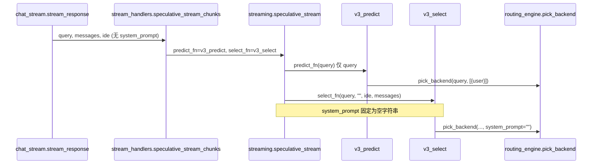

# 流式选路一致性 P0 设计文档

**日期：** 2026-06-13
**Owner：** zhuguang-ZFG
**状态：** 已实现（2026-06-13）
**前置：** [`2026-06-13-routing-authority-bypass-audit.md`](2026-06-13-routing-authority-bypass-audit.md) Phase 0–2 已完成
**权威：** [`docs/REQUEST_PIPELINE_AUTHORITY_CN.md`](../../REQUEST_PIPELINE_AUTHORITY_CN.md)

---

## 一、背景与问题

Phase 0–2 已将 `routes/` 内 `routing_engine.select|execute` 直调归零，并引入 `pick_backend()` 统一选路前半段。项目级 code review（2026-06-13）结论为 **COMMENT / WATCH**：

- **入口已统一**，但 **speculative 流式热路径** 与 `route()` / 非流式 `v3_route` 在输入上下文上仍可能分叉。
- **`token_sync`** 日志已可观测，但 **校验语义偏松**，存在把无效 token 写入运行时 override 的风险。

本设计仅覆盖 **P0 三项**（行为一致 + token 安全）。P1（`orchestrate` call_fn 上下文、`prefer` 死代码、logging 格式等）与 Phase 3（模块边界）不在本里程碑内。

---

## 二、目标与非目标

### 目标（P0）

| ID | 目标 | 可验证标准 |
|----|------|------------|
| P0-A | speculative 流式选路与非流式使用 **相同 preflight 上下文**（`messages` + `system_prompt` + `ide_source`） | 同一请求在 mock/stub 下 `v3_predict` 与 `v3_select` 返回相同 `backend`（高概率场景） |
| P0-B | `v3_predict` 不再仅用单条 user 消息 | `pick_backend` 输入与 `v3_select` 对齐（除性能允许的轻量路径外） |
| P0-C | `token_sync` 仅在校验 **明确成功** 时写入 override | 401/403/429/5xx 及网络异常均 **不** 写入 `_token_overrides` |

### 非目标

- 不重写 speculative streaming 算法（并行预测 + 切换逻辑保持不变）。
- 不合并 `v3_call_stream` 内重复的 `classify_scenario` / digest 逻辑（P2）。
- 不修改 `eval_internal` eval 旁路（Phase 3+）。
- 不在本切片实现 `prefer` 模型别名强制路由（P1）。

---

## 三、现状与差距

### 3.1 调用链（流式 SSE）



### 3.2 差距表

| 调用点 | 当前入参 | 非流式 `v3_route` 等价入参 | 差距 |
|--------|----------|---------------------------|------|
| `v3_predict` | `query` → `[{user: query}]` | 完整 `messages` + `ide_source` + `system_prompt` | 多轮历史、IDE、system prompt 缺失 |
| `v3_select`（经 `speculative_stream`） | `system_prompt=""` | `sys_prompt_preview` | classify/skills 可能分叉 |
| `chat_stream` → `speculative_stream_chunks` | 未传 `sys_prompt_preview` | 兜底 `_authoritative_route` 已传 | 主路径与兜底路径不一致 |
| `token_sync._validate_token` | 非 401 HTTP → `True` | 仅 2xx + 有效 body → `True` | 可能写入坏 token |

---

## 四、方案概览

采用 **最小签名扩展 + 上下文透传**，不引入新路由引擎阶段：

1. 在 `streaming.speculative_stream` / `routes/stream_handlers.speculative_stream_chunks` / `routes/chat_stream.stream_response` 三层 **透传 `system_prompt`**。
2. 扩展 `v3_predict` 签名，与 `v3_select` 共享 `_pick_for_stream()` 内部 helper（DRY）。
3. 收紧 `token_sync._validate_token` 成功条件，并补充单元测试。

**不采用**「流式改走完整 `route()`」方案：会阻塞首包 latency，与 speculative 设计目标冲突。

---

## 五、详细设计

### 5.1 P0-A / P0-B：Speculative 上下文对齐

#### 5.1.1 新增内部 helper（`routes/v3_adapters.py`）

```python
def _pick_for_stream(
    query: str,
    messages: list,
    *,
    system_prompt: str = "",
    ide: str = "",
) -> routing_engine.PickResult:
    """流式 speculative 选路：与 v3_select 共享 pick_backend 入参。"""
    return routing_engine.pick_backend(
        query,
        messages if messages else [{"role": "user", "content": query}],
        ide_source=_normalize_ide_source(ide),
        system_prompt=system_prompt or "",
    )
```

- `v3_select` 改为调用 `_pick_for_stream`，返回 `(picked.backend, picked.messages)`。
- `v3_predict` 改为调用 `_pick_for_stream`，仅返回 `picked.backend`。

#### 5.1.2 扩展 `PredictFn`（`streaming.py`）

**现状：**

```python
PredictFn = Callable[[str], str]
SelectFn = Callable[[str, str, str, list], tuple[str, list]]
```

**目标：**

```python
PredictFn = Callable[[str, list, str, str], str]
# (query, messages, system_prompt, ide) -> backend
```

`speculative_stream` 内：

```python
predicted = predict_fn(
    query,
    messages if messages else [{"role": "user", "content": query}],
    system_prompt,
    ide,
)
route_task = asyncio.create_task(
    asyncio.to_thread(select_fn, query, system_prompt, ide, messages)
)
```

新增参数（均带默认值，便于测试注入）：

```python
async def speculative_stream(
    query: str,
    messages: list,
    max_tokens: int,
    ide: str,
    predict_fn: PredictFn,
    select_fn: SelectFn,
    ...,
    system_prompt: str = "",
) -> AsyncIterator[tuple[str, str]]:
```

#### 5.1.3 路由层接线

| 文件 | 变更 |
|------|------|
| `routes/stream_handlers.py` | `speculative_stream_chunks(..., system_prompt: str = "")` 并传入 `streaming.speculative_stream` |
| `routes/chat_stream.py` | `speculative_stream_chunks(..., ide_source, system_prompt=sys_prompt_preview)` |
| `scripts/stream_latency_evidence.py` | 同步签名（可选 `system_prompt=""`） |
| `test_streaming.py` | 更新 mock `predict_fn(query, messages, system_prompt, ide)` |

**向后兼容：** 生产路径仅 `chat_stream` 调用；测试与脚本同步更新 mock 签名即可。无外部 HTTP API 变更。

#### 5.1.4 性能说明

`v3_predict` 与 `v3_select` 将各调用一次 `pick_backend()`（与 Phase 2 相同）。P0 不消除双重 `pick_backend` 调用；若后续需优化，可在 `speculative_stream` 内缓存 `select_fn` 的 `PickResult` 并令 `predict_fn` 读取缓存（**非本切片**）。

---

### 5.2 P0-C：`token_sync` 校验收紧

#### 5.2.1 成功条件（唯一写入 gate）

`_validate_token` 返回 `True` **当且仅当**：

1. HTTP 响应状态 **200–299**；
2. JSON 解析成功；
3. `choices[0].message.content` 非空（与现有逻辑一致）。

#### 5.2.2 失败条件

| 情况 | 返回值 | 日志级别 |
|------|--------|----------|
| HTTP 401 | `False` | `warning`（invalid key） |
| HTTP 403/429/4xx/5xx | `False` | `warning`（含 status code） |
| 网络/超时/JSON 异常 | `False` | `warning`（含异常类型） |

**移除**「非 401 即视为 transient 成功」语义。运维若需「网络抖动暂不拒绝」，应通过 **重试** 或 **人工确认后 sync**，而非自动接受 override。

#### 5.2.3 实现要点

- 继续使用 `urllib`（本切片不迁移 `httpx`，避免扩大范围）。
- 读取 `HTTPError` 时检查 `e.code`；`urlopen` 成功则检查 status（通常已是 2xx）。
- `sync_tokens` 失败消息从 `"401 or timeout"` 泛化为 `"validation failed"`，避免误导。

---

## 六、测试计划

### 6.1 新增 / 更新测试文件

| 文件 | 场景 |
|------|------|
| `tests/test_stream_routing_consistency.py`（新建） | mock `pick_backend`，断言 predict/select 收到相同 `ide_source` / `system_prompt` / `messages` |
| `tests/test_stream_routing_consistency.py` | 多轮 `messages` 下 predict backend == select backend |
| `tests/test_token_sync_validation.py`（新建） | 401/403/500/超时 → `False`；200 + content → `True` |
| `test_streaming.py` | 更新 `PredictFn` mock 签名；可选新增 system_prompt 影响 switch 的用例 |
| `tests/test_routing_pipeline_authority.py` | 无需变更 bypass 规则 |

### 6.2 验收命令

```powershell
# P0 回归
python -m pytest tests/test_stream_routing_consistency.py tests/test_token_sync_validation.py test_streaming.py -q

# 权威 + 路由
python -m pytest tests/test_routing_pipeline_authority.py tests/test_routing_engine.py -q

# bypass 仍为零
rg "routing_engine\.(select|execute)\(" routes/
```

### 6.3 手工 smoke（可选）

```powershell
# 本地 server 启动后，同一 IDE 会话流式 vs 非流式对比 x_lima_meta.backend（需 LIMA_API_KEY）
curl -sf http://127.0.0.1:8080/health
```

---

## 七、实施切片与文件清单

| 顺序 | 切片 | 文件 | 预估行数 |
|------|------|------|----------|
| 1 | helper + v3_predict/select | `routes/v3_adapters.py` | ~30 |
| 2 | speculative 签名 | `streaming.py`, `routes/stream_handlers.py` | ~25 |
| 3 | chat 接线 | `routes/chat_stream.py` | ~5 |
| 4 | token 校验 | `routes/token_sync.py` | ~20 |
| 5 | 测试 | `tests/test_stream_routing_consistency.py`, `tests/test_token_sync_validation.py`, `test_streaming.py` | ~120 |
| 6 | 脚本 | `scripts/stream_latency_evidence.py` | ~5 |

单文件目标仍遵守 AGENTS.md ≤300 行；新测试文件独立拆分。

---

## 八、风险与回滚

| 风险 | 缓解 |
|------|------|
| predict/select 更慢（双 pick_backend + 更重 messages） | 可接受；与 Phase 2 一致；后续可缓存 PickResult |
| 校验收紧导致 Windows token sync 失败率上升 | 日志含 backend + HTTP code；运维可重试；不再 silent 接受坏 token |
| PredictFn 签名变更破坏外部 fork | 本仓库内调用点有限；测试/mock 同步更新 |

**回滚：** 各切片独立 revert；不涉及 DB/schema；VPS 按 [`docs/DEPLOY_AND_RELEASE_CONVENTION.md`](../../DEPLOY_AND_RELEASE_CONVENTION.md) 单文件替换即可。

---

## 九、完成定义（DoD）

- [x] `chat_stream` 主路径传入 `sys_prompt_preview` 至 speculative 栈
- [x] `v3_predict` / `v3_select` 通过 `_pick_for_stream` 共享上下文
- [x] `token_sync` 非 2xx 不写入 override
- [x] 新增测试 green；既有 authority/streaming 测试无回归
- [x] 更新 [`2026-06-13-routing-authority-bypass-audit.md`](2026-06-13-routing-authority-bypass-audit.md) P0 行状态
- [ ] 本地 pytest 通过后部署 VPS health/smoke（若走 milestone closeout）

---

## 十、后续（P1，本文档不实现）

1. `orchestrate._route_via_engine` 的 `call_fn` 传递 `ide` / `system_prompt`
2. `prefer` 模型别名在流式路径的行为定义或移除
3. `routing_engine.py` 4 处 `_log.debug` `%s` 修复
4. `REQUEST_PIPELINE_AUTHORITY.md` 与 Phase 0 精简后实现对齐
5. Phase 3：`select`/`execute` 内部化 + `routing_engine` 拆分

---

## 十一、参考

- Code review 结论：会话 2026-06-13（COMMENT / WATCH）
- 已交付 commit：`a0aa08d`, `ce113d8`, `36d3273`
- OpenAI 兼容流式入口：`routes/chat_stream.py` → `routes/stream_handlers.py` → `streaming.py`
