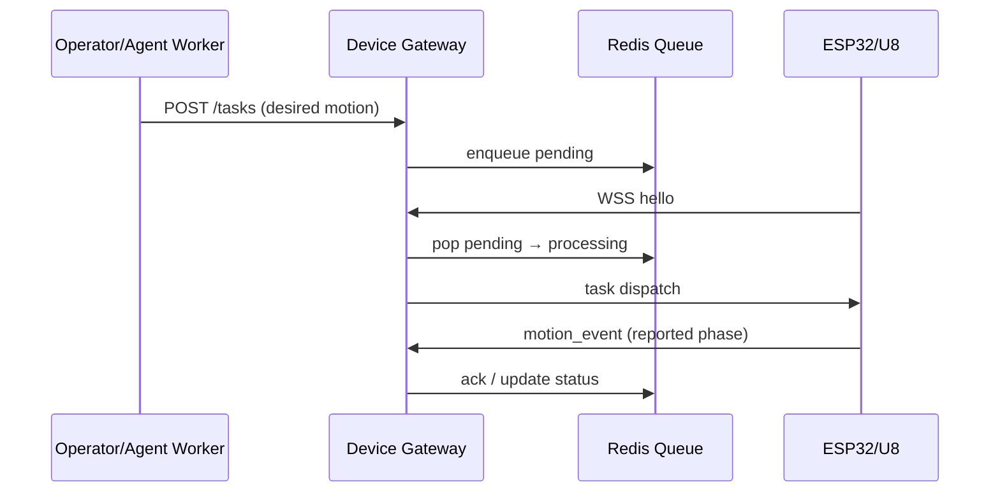

# Device Platform Reference (PE-F-1)

> **Status:** Active reference | **Created:** 2026-05-26  
> **Scope:** ThingsBoard CE vs Eclipse Ditto vs LiMa Device Gateway — **借鉴，不替换生产路径**。

## 1. 对照总览

| 维度 | ThingsBoard CE | Eclipse Ditto | LiMa Device Gateway |
|------|----------------|---------------|---------------------|
| 定位 | IoT 平台 + 规则引擎 + UI | 数字孪生 / 物模型 API | LiMa 编码助手 ↔ ESP32/U8 **执行面** |
| 设备模型 | Device + Asset + 属性/遥测 | Thing `attributes` / `features` | `device_id` + motion/task JSON |
| 期望状态 | Server-side attributes / RPC | **`desired`** properties | HTTP `POST /device/v1/tasks` body |
| 上报状态 | Client telemetry | **`reported`** properties | WebSocket `motion_event` phases |
| 策略/权限 | RBAC + rule chains | **`policy`** on things | per-device token + allowlist |
| 持久化 | PostgreSQL + Cassandra 可选 | MongoDB / PostgreSQL | Redis（实时）+ 内存 fallback |
| 多进程 HA | 集群 + 队列 | 水平扩展 API | **Redis** pending/processing 队列（已部署） |
| LiMa 关系 | 参考 CMDB/仪表盘 | 参考 twin 语义 | **生产权威** |

**结论（ADR 摘要）：** 不引入外部 CMDB 作为默认路径；TB/Ditto 仅作台账、孪生、可视化参考。LiMa DG 继续 owning 实时任务与 WebSocket 协议。

## 2. Ditto 状态模型 → LiMa DG 映射（F-1.2）

Ditto Thing 典型结构：

```text
thingId: lima:u8-fake-01
policy: { "entries": { "DEVICE": { "permissions": ["READ","WRITE"] } } }
features:
  motion:
    properties:
      desired:  { "path_id": "safe-home", "feed_mm": 1200 }
      reported: { "phase": "executing", "x_mm": 400, "y_mm": 200 }
  connectivity:
    properties:
      reported: { "ws": "connected", "rssi": -62 }
```

LiMa 现有等价物：

| Ditto | LiMa DG | 说明 |
|-------|---------|------|
| `desired` | Task `request` JSON（goal/path/params） | `POST /device/v1/tasks` 创建 |
| `reported` | Task `status` + `motion_event` stream | `queued` → `dispatching` → `executing` → `done` / `failed` |
| `policy` | `LIMA_DEVICE_TOKENS` + nginx route | 无 per-feature ACL；设备级 token |
| Thing features | `protocol_families` / motion phases | U8/ESP32 协议族，非通用 feature 树 |
| Twin revision | Redis task state + `task_id` | 无 Ditto revision 号；用 `task_id` + event 序 |

**映射草图（motion 任务）：**



LiMa **不**维护完整 digital twin graph；仅 task + event 时间线。若未来需要 twin 只读镜像，可在 OpenObserve/Postgres 审计层投影，不改 WSS 热路径。

## 3. ThingsBoard CE 可借鉴点

| TB 能力 | LiMa 可借鉴 | 当前 LiMa |
|---------|-------------|-----------|
| Device dashboard | Operator Telegram `/device status` | ✅ 已有摘要 |
| Alarm rules | Telegram health/degraded 告警 | ✅ health_tracker |
| Rule chains | routing_engine 五层 | ✅ 独立域 |
| OTA / firmware | ESP32 独立刷机流程 | 不在 DG 热路径 |
| Tenant hierarchy | 单 Operator 个人项目 | 不需要 multi-tenant |

TB CE 适合「多设备台账 + 可视化 + 规则」；LiMa 仅需 **编码生产力 + 单/少量设备执行**，引入 TB 运维成本 > 收益。

## 4. ESPHome / fake-u8（F-1.3，默认关）

| 选项 | 用途 | 状态 |
|------|------|------|
| `esp32S_XYZ/fake-u8` smoke | 无真机联调 | ✅ 已有 fake smoke |
| ESPHome compose | 传感器样机 | **不默认部署**；见 `docs/ESP32S_XYZ_MANAGEMENT_CN.md` |

PE-F-1 不在生产路径增加 ESPHome 依赖。

## 5. ADR：是否引入外部设备平台（F-1.4）

**决策：** **否（默认）** — 保持 LiMa Device Gateway 为设备执行权威。

**理由：**

1. 已有 Redis HA、协议族、Telegram 运维闭环，替换成本高。
2. TB/Ditto 强项（多租户 CMDB、复杂规则、全量 twin UI）与 LiMa「个人编码助手」目标不对齐。
3. Superpowers 原则：渐进式替换 — 先 OpenObserve/Netdata 补观测，再评是否需要 twin 投影。

**何时重新评估：**

- 管理设备 >10 且需独立 Operator UI 台账
- 需要跨设备 desired/reported Diff 可视化
- 需要 OTA/证书生命周期统一管理

**批准引入时的边界：**

- 只读同步 LiMa task/event → Ditto/TB（异步，非热路径）
- 不替换 `/device/v1/ws` 与 Redis 队列
- 默认关 env flag

## 6. 相关文档

| 文档 | 内容 |
|------|------|
| `docs/superpowers/plans/2026-05-25-lima-device-gateway-ha.md` | Redis HA 队列语义 |
| `docs/ONLINE_DISTRIBUTIONS_CN.md` | 公网 `/device/v1/*` 路由 |
| `docs/ESP32S_XYZ_MANAGEMENT_CN.md` | ESP32/fake-u8 证据 |
| `docs/OPENOBSERVE_SETUP.md` | 历史日志（FRP/Redis/DG 场景） |

## 7. 验收（PE-F-1）

- [x] TB CE vs Ditto vs LiMa DG 对照表
- [x] Ditto desired/reported/policy 映射草图
- [x] ADR：默认不引入外部 CMDB
- [x] 无 Device Gateway 生产代码改动
