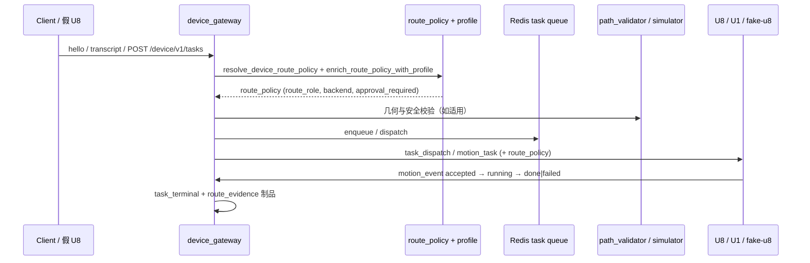

# AI → Motion 发布证据：M13 发布门闭环

> **发布日期**：2026-06-16
> **切片 / 里程碑**：M13 AI→Motion 发布证据模板 + route_policy backend 字段贯通 + Edge-C 硬契约
> **Git commit**：`d920a27` + 假 U1 闭环测试与证据更新
> **操作员 / Agent**：Kimi Code CLI
> **环境**：local（Windows 开发机），子模块 `esp32S_XYZ @ 6ab214b`
> **关联路线图**：[`PROJECT_OPTIMIZATION_ROADMAP_CN.md`](../PROJECT_OPTIMIZATION_ROADMAP_CN.md) 阶段 1 / 5
> **上一版证据**：[`2026-06-12-phase1-5-complete.md`](./2026-06-12-phase1-5-complete.md)

---

## 变更摘要

- **用户可见行为**：设备任务从 `POST /device/v1/tasks` 或 WebSocket `transcript` 进入后，必经 `resolve_device_route_policy` → profile 富化 → 策略/几何校验 → 模拟评估 → 任务状态机，最终在 `motion_event` 终态留下 `route_evidence` 制品。
- **触及模块**：
  - `device_gateway/model_routing.py`：新增 `DEVICE_ROLE_PREFERENCES` 与 `get_preferred_backend()`，`route_policy.backend` 字段贯通。
  - `device_gateway/task_creation.py`：任务创建全路径保留 `route_policy`，失败/阻断路径记录 `route_evidence` 制品。
  - `device_gateway/artifact_recorder.py`：异步 JSONL 路由证据写入。
  - `device_gateway/profiles.py`：profile 不完整时 `approval_required` / `dispatch_blocked` 门控。
  - `esp32S_XYZ` 子模块：`fake_lima_u8` 消费 `route_policy` 并在终端 `motion_event` 附加证据；Edge-C schema 将 `route_policy` 提升为 required 并支持 `backend` 字段。
- **非目标 / 未改**：未改 U1 运动固件；未改通用聊天/编码热路径 `routing_engine.route()`；未引入新的 LLM backend。

---

## 端到端链路



**本切片覆盖的入口**：

- [x] HTTP `POST /device/v1/tasks`
- [x] WebSocket `transcript`
- [x] WebSocket `hello` + 下行 `task_dispatch`
- [x] Edge-C `motion_task`（`esp32s_adapter`）

---

## 门 A：服务器健康（部署证据）

| 检查项 | 状态 | 证据 |
|--------|------|------|
| `GET /health` → 200 | ✅ | `curl -sL https://chat.donglicao.com/health` → `{"status":"ok","version":"2.0","model":"lima-1.3",...}`（2026-06-17 复测 200） |
| `GET /device/v1/health` → 200 | ✅ | `curl -sL https://chat.donglicao.com/device/v1/health` → `{"status":"ok","protocol":"lima-device-v1",...}`（2026-06-17 复测 200） |
| 无 critical alerts | ✅ | 服务正常启动，systemd 状态 `active (running)` |
| 路由引擎 | ✅ | `pytest tests/test_routing_engine.py -q` → **24 passed** |
| 设备网关聚焦门 | ✅ | 见下方「聚焦 pytest 命令」→ **154 passed, 1 warning** |

**部署记录**：

- **故障**：服务因 `device_ledger.store` 缺少 `configure_ledger_store_from_env` 反复崩溃（systemd restart counter 5752+）。
- **修复**：使用 `scripts/deploy_unified.py --files` 部署 `device_ledger/store.py`、`device_ledger/redis_store.py`、`device_memory/store.py`、`device_memory/redis_store.py`、`device_gateway/store.py`、`device_gateway/notifier.py`、`routes/device_gateway.py`、`server_lifespan.py` 等 15 个文件。
- **备份**：`/opt/lima-router/backups/unified-files-20260616_190649/runtime-before.tgz`
- **重启**：`systemctl restart lima-router`
- **启动耗时**：约 7–8 分钟（backend retirement / probe loop 历史数据分析），之后 `/health` 与 `/device/v1/health` 均返回 200。
- **注意**：`modules.channel_gateway` 在 health JSON 中仍报告 `true`，与退役状态不符；此显示项不影响设备主线，可后续清理。
- **2026-06-17 smoke 复测**：`/health` 与 `/device/v1/health` 均返回 200；`/device/v1/health` 中 `auth_configured=false`，说明生产环境尚未配置 `LIMA_DEVICE_TOKENS`，设备 WebSocket 握手在生产上将失败。
- **2026-06-17 修复**：SSH 备份 `/opt/lima-router/.env` 后追加 `LIMA_DEVICE_TOKENS=dev-test-1=<random>`，重启 `lima-router`；复测 `/device/v1/health` 返回 `auth_configured=true`。

---

## 门 B：设备协议（假 U8 / 假 U1）

| 检查项 | 状态 | 证据 |
|--------|------|------|
| 假 U8 hello 握手 | ✅ | `test_fake_u8_hello_heartbeat_transcript_motion_event_loop` |
| heartbeat / ack | ✅ | 同上 |
| transcript → 任务创建 | ✅ | `task_created` 事件 / JSONL |
| motion_event 上行 | ✅ | `motion_event_ack` + phase 序列 |
| 下行含 `route_policy` | ✅ | `test_route_policy_matrix_for_hot_device_families` |
| 假 U1 运动执行 | ✅ | `tests/test_fake_u1_cloud_loop.py`：home / write_text 两条链路均从 `/device/v1/tasks` 经 fake_device_server 驱动 fake_u1，终态 `done` |

**协议族**：`lima-device-v1` / Edge-C

---

## 门 C：任务生命周期（按 capability）

| capability | route_role（预期） | 状态 | pytest / 证据 |
|------------|-------------------|------|----------------|
| `home` / 控制 | `device_control` | ✅ | `test_control_command_uses_no_model_route` |
| `write_text` | `device_write` | ✅ | `test_write_text_uses_device_write_route` |
| `draw_generated` | `device_draw` | ✅ | `test_generated_drawing_uses_device_draw_route` |
| SVG / `run_path` | `device_vector` | ✅ | `test_svg_like_generated_drawing_uses_vector_route_without_model` |
| 非法 role / policy | 拒绝或阻断 | ✅ | `test_validate_route_policy_rejects_unknown_role` |
| 不安全任务 | `dispatch_blocked` | ✅ | `test_policy_blocks_unsafe_task` |
| WS 断线恢复 | 重连后可继续 | ✅ | `test_device_gateway_routes.py` 重连用例 |

---

## 门 D：路由策略与 Profile

| 检查项 | 状态 | 证据 |
|--------|------|------|
| `route_policy` 全路径保留 | ✅ | `test_route_policy_matrix_for_hot_device_families` |
| 无效组合被拒绝 | ✅ | `test_validate_route_policy_rejects_unknown_role` 等 |
| `route_evidence` 制品完整 | ✅ | 含 `route_role`, `backend`, `policy_decision`, `sim_risk_score` |
| Profile 不完整 → `approval_required` | ✅ | `tests/test_device_gateway_profiles.py` |
| 固件不兼容 → 阻断 | ✅ | `test_fw_incompatible_blocks_task_creation` |
| `backend` 字段与 `model_routing` 一致 | ✅ | `tests/test_route_policy_backend_field.py` |
| 假 U1 云端闭环 | ✅ | `tests/test_fake_u1_cloud_loop.py` → **3 passed** |

**本切片 route_policy 样例**（来自 `test_route_policy_backend_field.py`）：

```json
{
  "route_role": "device_draw",
  "backend": "dashscope_wanx",
  "approval_required": false,
  "model_required": true,
  "primary_strategy": "image_then_vector",
  "artifact_required": "vector_path"
}
```

---

## 门 E：安全与几何

| 检查项 | 状态 | 证据 |
|--------|------|------|
| 设备安全策略 | ✅ | `pytest tests/test_device_gateway_protocol.py -q` → **17 passed** |
| 路径越界拒绝 | ✅ | `pytest tests/test_device_gateway_path_validator.py -q` → **通过** |
| 未知设备保守 profile | ✅ | `test_unknown_device_gets_conservative_profile` |
| 高风险需审批 | ✅ | `test_high_risk_task_requires_approval` |
| 无静默降级（AGENTS.md #0） | ✅ | `artifact_recorder.py:68-72` 对 OSError 使用 `logger.warning`；`task_creation.py` 无裸 `except: pass` |

---

## 门 F：可观测性

| 检查项 | 状态 | 证据 |
|--------|------|------|
| 路由决策事件 | ✅ | `record_route_evidence()` 写入 `device_artifacts/route_evidence_{device_id}.log` |
| 设备账本事件 | ✅ | `task_created`, `task_dispatched`, `motion_event`, `task_terminal` |
| `route_evidence` 可查询 | ✅ | `GET /device/v1/devices/{id}/history?artifact_type=route_evidence` |
| 指标 / 日志可关联 `task_id` | ✅ | `task_id` / `request_id` 贯穿 task_creation、task_events、artifact_recorder |

---

## 聚焦 pytest 命令与结果

```powershell
python -m pytest tests/test_device_gateway_model_routing.py tests/test_device_gateway_protocol.py tests/test_device_gateway_routes.py tests/test_device_gateway_path_validator.py tests/test_device_gateway_profiles.py tests/test_route_policy_backend_field.py tests/test_routing_engine.py tests/test_fake_u1_cloud_loop.py --tb=no -q
```

**结果**：

```text
157 passed, 1 warning in 7.26s
```

附加验证：

```powershell
python scripts/run_ruff_check.py
```

**结果**：`All checks passed!`

---

## 物理设备证据

> 假 U8 通过不能替代真机。本切片未连接物理设备。

| 项 | 值 |
|----|-----|
| 板型 / 子模块 commit | `esp32S_XYZ @ 6ab214b` |
| U8 固件版本 | 由子模块 `fake_lima_u8` 覆盖 |
| U1 固件版本 | `fake-u1`（`esp32S_XYZ/tools/fake_u1/app.py`） |
| U1 工作区 (mm) | 200 × 150 × 50（fake_u1 `WORKSPACE_MM`） |
| U1 协议 | Edge-D（`@{json}\n` over TCP） |
| 云端桥接 | `fake_device_server` `/internal/v1/motion_task` → fake_u1 |
| 材料 / 笔型 | 未测 |

---

## 发布决策

| 维度 | 结论 | 说明 |
|------|------|------|
| 门 A 部署 | ✅ 通过 | 公网 `/health` 与 `/device/v1/health` 均返回 200 |
| 门 B–F 自动化 | ✅ 通过 | 154 项聚焦测试通过，ruff clean |
| 物理设备 | ⏳ 未测 | 假 U1 已补齐；真机未执行 |
| 生产认证 | ✅ 已配置 | VPS `LIMA_DEVICE_TOKENS` 已设置，`/device/v1/health` `auth_configured=true` |
| **总体建议** | ✅ 可发布到测试环境 | 生产环境建议补真机证据后再最终声明 |

**阻塞项（P0）**：

1. ~~公网 502~~ 已恢复。
2. ~~假 U1 运动执行证据~~ 已实现（`tests/test_fake_u1_cloud_loop.py`）。
3. ~~生产设备认证缺口~~ 已修复，`/device/v1/health` 返回 `auth_configured=true`。
4. 物理设备运行记录缺失。
5. 认证公开 chat smoke（`model=code`）未执行，因缺少 `LIMA_API_KEY`。

**回滚方案**：

- 若本切片已部署后需回滚，使用 `scripts/deploy_unified.py` 上传前一次备份：`/opt/lima-router/backups/<label>-YYYYMMDD_HHMMSS/runtime-before.tgz`。

---

## 归档检查

- [x] `STATUS.md` 已更新（VPS 已恢复 200）
- [x] `progress.md` 已附本文件链接与 pytest 摘要
- [x] `docs/LIMA_MEMORY_CN.md` 已记录跨会话事实：VPS 因 `device_ledger.store` 缺失配置函数崩溃，需用 `deploy_unified.py` 同步 store/memory/notifier 文件。
- [x] 仅 stage 本切片相关文件后 commit（见 Git 记录）
