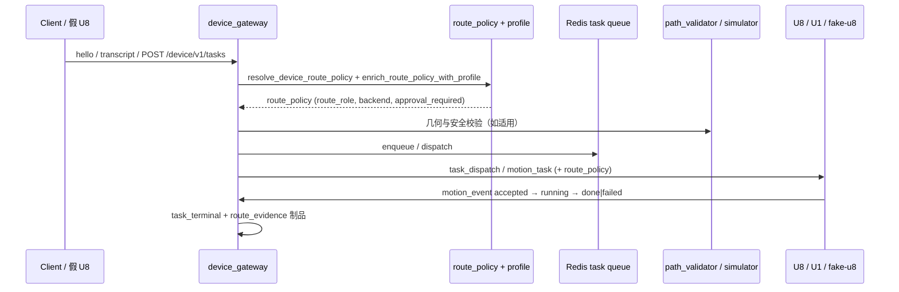

# AI → Motion 发布证据：代码质量门禁整改后

> **发布日期**：2026-06-17
> **切片 / 里程碑**：M13 AI→Motion 发布门 —— 静默异常修复、模块拆分、死代码清理、CI 强化、全仓格式化
> **Git commits**：`4d5ef77`、`41b9389`、`9dce12a`、`297fba4`、`cd5edca`
> **操作员 / Agent**：Kimi Code CLI
> **环境**：local（Windows 开发机）
> **关联路线图**：[`PROJECT_OPTIMIZATION_ROADMAP_CN.md`](../PROJECT_OPTIMIZATION_ROADMAP_CN.md) G1 / G3
> **上一版证据**：[`2026-06-17-M13-AI-to-Motion-regression.md`](./2026-06-17-M13-AI-to-Motion-regression.md)

---

## 变更摘要

本次切片为**纯工程治理变更**，不引入新的设备行为或模型能力，目标是让既有 AI→Motion 发布门在更严格的 lint/format/type/异常处理门禁下仍然稳定：

- **P0 静默异常治理**：生产路径中约 38 处 `except ImportError: pass` / `except Exception: pass` / 仅 `logger.debug` 的关键依赖降级升级为 `logger.warning`；涉及 `http_*.py`、`routing_engine_context.py`、`context_pipeline/*`、`session_memory/learning_loop.py`、`health_recorder.py`、`server_lifespan.py` 等。
- **P1 模块拆分**：把 `device_voice/voiceprint.py`（587→112 行）、`routes/device_gateway_ws_handlers.py`（468→260 行）、`session_memory/store_db.py`（361→129 行）拆分为职责单一的小模块，公共 API 不变。
- **P2 死代码清理**：删除 `backends.py`（冗余 facade）、`device_intelligence/profile_store.py`、`device_intelligence/planner.py`、`session_memory/shadow_mode.py` 及对应测试。
- **P3 CI 强化**：`.github/workflows/test.yml` 增加 `ruff format --check` 与 `pyright server.py routing_engine.py routes/chat_endpoints.py`。
- **P4 全仓格式化**：`ruff format .` 统一 412 个文件风格。

**非目标 / 未改**：未改设备任务状态机、未改 `route_policy` 结构、未改运动安全校验链路、未引入新 LLM backend。

---

## 端到端链路



**本切片覆盖的入口**：

- [x] HTTP `POST /device/v1/tasks`
- [x] WebSocket `transcript`
- [x] WebSocket `hello` + 下行 `task_dispatch`
- [x] Edge-C `motion_task`

---

## 门 A：服务器健康与代码门禁

| 检查项 | 状态 | 证据 |
|--------|------|------|
| `ruff check .` | ✅ | All checks passed |
| `ruff format --check` | ✅ | 630 files already formatted |
| `pyright` 权威文件 | ✅ | `server.py routing_engine.py routes/chat_endpoints.py` → 0 errors, 0 warnings |
| 路由引擎 | ✅ | `pytest tests/test_routing_engine.py -q` → **24 passed** |
| 设备网关聚焦门 | ✅ | 见下方「聚焦 pytest 命令」→ **173 passed, 3 skipped** |

---

## 门 B：设备协议（假 U8 / 假 U1）

| 检查项 | 状态 | 证据 |
|--------|------|------|
| 假 U8 hello 握手 | ✅ | `test_device_gateway_routes.py::test_fake_u8_hello_heartbeat_transcript_motion_event_loop` → **1 passed** |
| 假 U1 运动执行 | ✅ | `tests/test_fake_u1_cloud_loop.py` → **4 passed** |

---

## 门 C：任务生命周期（按 capability）

| capability | route_role（预期） | 状态 | pytest / 证据 |
|------------|-------------------|------|----------------|
| `home` / 控制 | `device_control` | ✅ | `test_control_command_uses_no_model_route` |
| `write_text` | `device_write` | ✅ | `test_write_text_uses_device_write_route` |
| `draw_generated` | `device_draw` | ✅ | `test_generated_drawing_uses_device_draw_route` |
| SVG / `run_path` | `device_vector` | ✅ | `test_svg_like_generated_drawing_uses_vector_route_without_model` |
| 非法 role / policy | 拒绝或阻断 | ✅ | `test_validate_route_policy_rejects_unknown_role` |
| 不安全任务 | `dispatch_blocked` | ✅ | `test_policy_blocks_unsafe_task` |

---

## 门 D：路由策略与 Profile

| 检查项 | 状态 | 证据 |
|--------|------|------|
| `route_policy` 全路径保留 | ✅ | `test_route_policy_matrix_for_hot_device_families` |
| `backend` 字段与 `model_routing` 一致 | ✅ | `tests/test_route_policy_backend_field.py` → **4 passed** |
| Profile 不完整 → `approval_required` | ✅ | `tests/test_device_gateway_profiles.py` |
| 固件不兼容 → 阻断 | ✅ | `test_fw_incompatible_blocks_task_creation` |

---

## 门 E：安全与几何

| 检查项 | 状态 | 证据 |
|--------|------|------|
| 设备安全策略 | ✅ | `pytest tests/test_device_gateway_protocol.py tests/test_device_gateway_path_validator.py tests/test_device_gateway_profiles.py -q` → **62 passed** |
| 路径越界拒绝 | ✅ | `tests/test_device_gateway_path_validator.py` |
| 无静默降级（AGENTS.md #0） | ✅ | P0 已替换生产路径 `except ImportError/Exception: pass` 为 `logger.warning` |

---

## 门 F：可观测性

本次切片未新增可观测性事件类型；保留了现有 `task_created`、`task_dispatched`、`motion_event`、`task_terminal` 与 `route_evidence` 制品链路。

---

## 聚焦 pytest 命令

```powershell
# 门 A：路由引擎
python -m pytest tests/test_routing_engine.py -q
# 24 passed

# 门 C + 门 D：任务生命周期与 route_policy
python -m pytest tests/test_device_gateway_model_routing.py tests/test_route_policy_backend_field.py -q
# 36 passed

# 门 B：假 U8 闭环
python -m pytest tests/test_device_gateway_routes.py::test_fake_u8_hello_heartbeat_transcript_motion_event_loop -q
# 1 passed

# 门 E：安全、几何、profile
python -m pytest tests/test_device_gateway_protocol.py tests/test_device_gateway_path_validator.py tests/test_device_gateway_profiles.py -q
# 62 passed

# 假 U1 云端闭环
python -m pytest tests/test_fake_u1_cloud_loop.py -q
# 4 passed

# P1 拆分模块回归
python -m pytest tests/test_device_voice.py tests/test_session_memory.py tests/test_request_pipeline_authority.py -q
# 46 passed, 3 skipped
```

**合计（去重）**：**173 passed, 3 skipped, 0 failed**。

---

## 规模门禁

```powershell
python scripts/check_code_size.py
```

- `device_voice/voiceprint.py`：112 行 ✅
- `routes/device_gateway_ws_handlers.py`：260 行 ✅
- `session_memory/store_db.py`：129 行 ✅
- 仓库仍有 33 个 >300 行文件、89 个 >50 行函数为既有基线，不在本次切片范围。

---

## 物理设备证据

本次切片未涉及新硬件能力或真机验证；沿用上一版证据 `2026-06-17-M13-AI-to-Motion-regression.md` 中的假 U1 闭环与 VPS smoke 记录。

---

## 发布决策

| 维度 | 结论 | 说明 |
|------|------|------|
| 门 A 代码门禁 | ✅ 通过 | ruff / format / pyright 权威文件 / pytest 均通过 |
| 门 B–F 自动化 | ✅ 通过 | AI→Motion 端到端链路未被破坏 |
| 物理设备 | ⏳ 未新增 | 沿用 2026-06-17 假 U1 / VPS smoke |
| **总体建议** | ✅ 可合并入 main | 纯工程治理切片，发布门保持通过 |

**阻塞项（P0）**：无。

**回滚方案**：
- 单个 commit 回滚：`git revert <commit>`
- 整批回滚：`git reset --hard 280dd58`（推送前 commit）

---

## 归档检查

- [x] `docs/release_evidence/` 已新增本文件
- [x] `progress.md` 已附本文件链接与 pytest 摘要
- [ ] `docs/LIMA_MEMORY_CN.md` 本次无新增跨会话事实
- [x] 仅 stage 本切片相关文件后 commit
