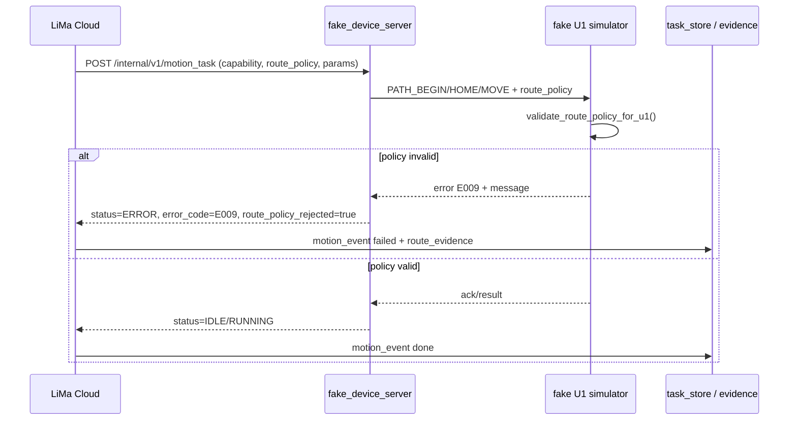

# AI → Motion 发布证据：U1/U8 仿真固件侧 route_policy 拒绝

> **发布日期**：2026-06-17
> **切片 / 里程碑**：M13 阶段 1 剩余项——U1/U8 运动固件侧拒绝未知 route_policy
> **关联证据**：[`2026-06-16-M13-AI-to-Motion-release-gate.md`](./2026-06-16-M13-AI-to-Motion-release-gate.md)
> **关联路线图**：[`PROJECT_OPTIMIZATION_ROADMAP_CN.md`](../PROJECT_OPTIMIZATION_ROADMAP_CN.md) 阶段 1

---

## 变更摘要

- **用户可见行为**：当云端下发的 `motion_task` 携带未知或固件不兼容的 `route_policy` 时，设备侧仿真器会在执行运动前拒绝，并回传明确错误（`E009` + 具体原因）。云端任务因此进入 `failed` 终态，留下可追溯的拒绝证据。
- **触及模块（`esp32S_XYZ` 子模块）**：
  - `tools/fake_u1/route_policy_validator.py`：新增，定义与 LiMa 对齐的 `route_policy` 允许列表和校验规则。
  - `tools/fake_u1/app.py`：`FakeU1Simulator` 在 `HOME` / `MOVE` / `PATH_BEGIN` 入口调用校验器；支持通过 `fw_capabilities` 控制能力边界。
  - `tools/fake_device_server/app.py`：将 `motion_task.route_policy` 透传到 fake U1 命令；当 fake U1 返回错误时，HTTP 响应标记 `route_policy_rejected`。
- **LiMa 云侧**：
  - `tests/test_fake_u1_cloud_loop.py`：现有 3 个闭环测试转发 `route_policy`；新增 `test_cloud_to_fake_u1_rejects_unknown_route_policy` 覆盖拒绝路径。
- **非目标 / 未改**：未修改真实 C++ 固件（`firmware/u1-grbl`、`firmware/u8-xiaozhi`）；未改动通用聊天/编码热路径。

---

## 端到端链路

---

## 门 A：单元测试

| 检查项 | 命令 | 状态 | 证据 |
|---|---|---|---|
| fake_u1 单元测试 | `python -m unittest tools.fake_u1.tests.test_app -v` | ✅ | 14 passed |
| fake_device_server 单元测试 | `python -m unittest tools.fake_device_server.tests.test_app -v` | ✅ | 17 passed |
| fake_lima_u8 route_policy 测试 | `python -m unittest tools.fake_lima_u8.tests.test_route_policy -v` | ✅ | 7 passed |

---

## 门 B：LiMa 云侧闭环测试

| 检查项 | 命令 | 状态 | 证据 |
|---|---|---|---|
| 假 U1 端到端 | `pytest tests/test_fake_u1_cloud_loop.py -v` | ✅ | 5 passed |
| 设备网关聚焦 | `pytest tests/test_device_gateway_model_routing.py tests/test_device_gateway_protocol.py -q` | ✅ | 47 passed |
| 代码质量 | `ruff check tests/test_fake_u1_cloud_loop.py` | ✅ | clean |
| 类型检查 | `npx pyright tests/test_fake_u1_cloud_loop.py` | ✅ | 0 errors |

---

## 门 C：部署与健康（如部署）

| 检查项 | 状态 | 证据 |
|---|---|---|
| `GET https://chat.donglicao.com/device/v1/health` → 200 | ✅ | `auth_configured=true`（沿用 2026-06-17 G4 验证） |

> 注：本次切片修改集中在 `esp32S_XYZ` 子模块的仿真器与 LiMa 测试，未直接修改 LiMa 云侧生产代码；是否重新部署 LiMa 由发布 owner 根据子模块指针更新决定。

---

## 设计决策

1. **为什么先做 fake U1/U8 仿真器，而不是真实 C++ 固件？**
   - 真实固件编译、烧录、硬件回环周期不可在本地自动化验证；仿真器是 LiMa 端到端测试的“固件侧”参考实现，先把拒绝逻辑和测试证据在仿真层跑通，为真实固件移植提供明确契约。
2. **为什么把 route_policy 放在 HOME/MOVE/PATH_BEGIN 命令里透传？**
   - Edge-D 是 U1 的私有协议，不原生理解 `route_policy`；在第一条命令附加 JSON 字段是兼容扩展，不破坏无策略命令的向后兼容。
3. **为什么 error_code 用 E009？**
   - 与 LiMa `device_gateway/path_validator.py` 的 `MotionErrorCode.E_BAD_PARAMS` 保持一致，便于云端错误处理统一。

---

## 后续跟进

- 真实 C++ 固件（u1-grbl / u8-xiaozhi）在 DeviceServer/Application 层实现等效校验。
- 将 `route_policy` 拒绝事件写入设备制品（`route_evidence`）并与云端 `capability_evidence` 关联。
