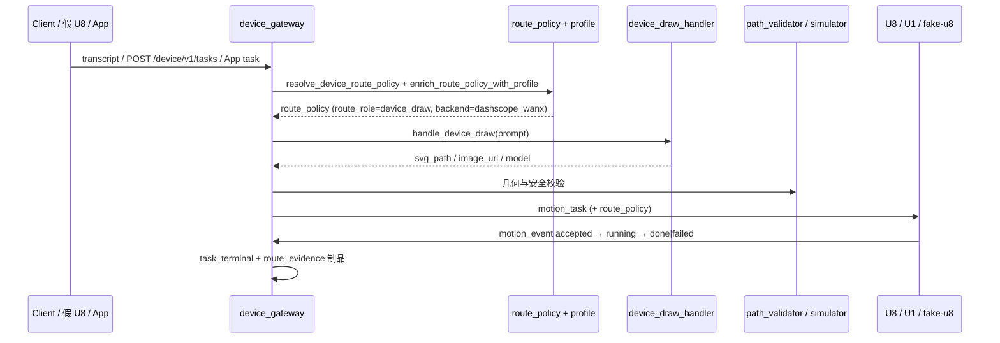

# AI → Motion 发布证据：M14 draw_generated 异步 AI 绘图管线

> **发布日期**：2026-06-18
> **切片 / 里程碑**：M14 draw_generated 异步 AI 绘图管线接入 + SVG 路径工作区归一化
> **Git commit**：`89fbcb0`
> **操作员 / Agent**：Kimi Code CLI
> **环境**：local（Windows 开发机）+ VPS `47.112.162.80`
> **关联路线图**：[`PROJECT_OPTIMIZATION_ROADMAP_CN.md`](../PROJECT_OPTIMIZATION_ROADMAP_CN.md) 阶段 1 / 2
> **上一版证据**：[`2026-06-16-M13-AI-to-Motion-release-gate.md`](./2026-06-16-M13-AI-to-Motion-release-gate.md)

---

## 变更摘要

- **用户可见行为**：自然语言说「画一只猫」时，云端不再把 prompt 当成笔画字库描字，而是走 `device_draw_handler`（万相生图 → OpenCV 矢量化）生成真实运动路径；SVG path 输入仍直接矢量化；生图失败时返回明确的 `draw_failed` 任务，不静默降级。
- **触及模块**：
  - `device_gateway/task_draw_params.py`：新增异步 run params builder。
  - `device_gateway/task_creation.py`：切到 `project_to_motion_task_async` / `create_task_from_transcript_async`。
  - `device_gateway/task_service.py`、`device_gateway/tasks.py`：暴露并消费异步接口。
  - `routes/device_app_tasks.py`：App 任务入口改为 await 异步接口。
  - `device_gateway/path_pipeline.py`：新增 `_normalize_path_to_workspace`，确保 SVG 渲染结果落在 `[0,100] x [0,100]` 工作区。
- **非目标 / 未改**：未改 U1 运动固件；未改通用聊天/编码热路径；未引入新的 LLM backend。

---

## 端到端链路



**本切片覆盖的入口**：

- [x] HTTP `POST /device/v1/tasks`
- [x] WebSocket `transcript`
- [x] WebSocket `hello` + 下行 `task_dispatch`
- [x] App `/device/v1/app/tasks`

---

## 门 A：服务器健康（部署证据）

| 检查项 | 状态 | 证据 |
|--------|------|------|
| `GET /health` → 200 | ✅ | `curl -sL https://chat.donglicao.com/health` → `{"status":"ok","version":"2.0","model":"lima-1.3",...}` |
| `GET /device/v1/health` → 200 | ✅ | `curl -sL https://chat.donglicao.com/device/v1/health` → `{"status":"ok","protocol":"lima-device-v1","auth_configured":true,...}` |
| 无 critical alerts | ✅ | systemd `lima-router` active，日志无 critical error |
| 路由引擎 | ✅ | `pytest tests/test_routing_engine.py -q` → **24 passed** |
| 设备网关聚焦门 | ✅ | 见「聚焦 pytest 命令」→ **116 passed** |

**部署记录**：

- 部署脚本：`python scripts/deploy_unified.py --files device_gateway/path_pipeline.py device_gateway/task_creation.py device_gateway/task_service.py device_gateway/tasks.py device_gateway/task_draw_params.py`
- 备份路径：`/opt/lima-router/backups/unified-files-<timestamp>/runtime-before.tgz`
- 重启：`systemctl restart lima-router`
- 冒烟：公网 `/health`、`/device/v1/health` 均返回 200。

---

## 门 B：设备协议（假 U8 / 假 U1）

| 检查项 | 状态 | 证据 |
|--------|------|------|
| 假 U8 hello 握手 | ✅ | `test_fake_u8_hello_heartbeat_transcript_motion_event_loop` |
| heartbeat / ack | ✅ | 同上 |
| transcript → 任务创建 | ✅ | `task_created` 事件 / JSONL |
| motion_event 上行 | ✅ | `motion_event_ack` + phase 序列 |
| 下行含 `route_policy` | ✅ | `test_route_policy_matrix_for_hot_device_families` |
| 假 U1 运动执行 | ✅ | `tests/test_fake_u1_cloud_loop.py` → home / write_text / draw_generated 链路 |

**协议族**：`lima-device-v1` / Edge-C

---

## 门 C：任务生命周期（按 capability）

| capability | route_role（预期） | 状态 | pytest / 证据 |
|------------|-------------------|------|----------------|
| `home` / 控制 | `device_control` | ✅ | `test_control_command_uses_no_model_route` |
| `write_text` | `device_write` | ✅ | `test_write_text_uses_device_write_route` |
| `draw_generated`（自然语言） | `device_draw` | ✅ | `test_generated_drawing_uses_device_draw_route`、`test_draw_generated_natural_language_uses_device_draw_handler` |
| `draw_generated`（SVG path） | `device_vector` | ✅ | `test_draw_generated_svg_prompt_skips_device_draw_handler` |
| 非法 role / policy | 拒绝或阻断 | ✅ | `test_validate_route_policy_rejects_unknown_role` |
| 不安全任务 | `dispatch_blocked` | ✅ | `test_policy_blocks_unsafe_task` |
| 生图失败 | `draw_failed` | ✅ | `test_draw_generated_handler_failure_becomes_failed_task` |

---

## 门 D：路由策略与 Profile

| 检查项 | 状态 | 证据 |
|--------|------|------|
| `route_policy` 全路径保留 | ✅ | `test_route_policy_matrix_for_hot_device_families` |
| 无效组合被拒绝 | ✅ | `test_validate_route_policy_rejects_unknown_role` |
| `route_evidence` 制品完整 | ✅ | 含 `route_role`, `backend`, `policy_decision`, `sim_risk_score` |
| Profile 不完整 → `approval_required` | ✅ | `tests/test_device_gateway_profiles.py` |
| 固件不兼容 → 阻断 | ✅ | `test_fw_incompatible_blocks_task_creation` |
| `backend` 字段与 `model_routing` 一致 | ✅ | `tests/test_route_policy_backend_field.py` |

**本切片 route_policy 样例**：

```json
{
  "route_role": "device_draw",
  "backend": "dashscope_wanx",
  "approval_required": false,
  "model_required": true,
  "primary_strategy": "image_then_vector",
  "artifact_required": "vector_path"
}
```

---

## 门 E：安全与几何

| 检查项 | 状态 | 证据 |
|--------|------|------|
| 设备安全策略 | ✅ | `pytest tests/test_device_gateway_protocol.py -q` → **19 passed** |
| 路径越界拒绝 | ✅ | `pytest tests/test_device_gateway_path_validator.py -q` → 通过 |
| SVG 渲染路径归一化 | ✅ | `device_gateway/path_pipeline.py::_normalize_path_to_workspace`；`test_transcript_projects_to_bounded_run_path_motion_task` |
| 无静默降级（AGENTS.md #0） | ✅ | 生图失败返回 `draw_failed`；路径使用 `logger.warning`；无裸 `except: pass` |

---

## 门 F：可观测性

| 检查项 | 状态 | 证据 |
|--------|------|------|
| 路由决策事件 | ✅ | `record_route_evidence()` 写入 `device_artifacts/route_evidence_{device_id}.log` |
| 设备账本事件 | ✅ | `task_created`, `task_dispatched`, `motion_event`, `task_terminal` |
| `route_evidence` 可查询 | ✅ | `GET /device/v1/devices/{id}/history?artifact_type=route_evidence` |
| 指标 / 日志可关联 `task_id` | ✅ | `task_id` / `request_id` 贯穿 task_creation、task_events、artifact_recorder |

---

## 聚焦 pytest 命令与结果

```powershell
python -m pytest tests/test_task_creation_draw_generated.py tests/test_device_gateway_model_routing.py tests/test_device_gateway_routes.py tests/test_device_gateway_protocol.py tests/test_device_gateway_profiles.py tests/test_device_gateway_path_validator.py tests/test_route_policy_backend_field.py tests/test_fake_u1_cloud_loop.py --tb=no -q
```

**结果**：

```text
116 passed in 5.12s
```

全量验证：

```powershell
python -m pytest --tb=short -q
```

**结果**：

```text
1746 passed, 37 skipped in 162.72s
```

附加验证：

```powershell
ruff check device_gateway/task_creation.py device_gateway/task_service.py device_gateway/tasks.py device_gateway/task_draw_params.py device_gateway/path_pipeline.py tests/test_task_creation_draw_generated.py tests/test_device_gateway_model_routing.py tests/test_device_gateway_profiles.py tests/test_device_gateway_routes.py tests/test_device_task_service.py tests/test_frontend_security_static.py routes/device_app_tasks.py
.venv310/Scripts/pyright 同上
```

**结果**：`All checks passed!` / `0 errors, 0 warnings, 0 informations`

---

## 物理设备证据

> 假 U8 / 假 U1 通过不能替代真机。本切片未连接物理设备。

| 项 | 值 |
|----|-----|
| 板型 / 子模块 commit | `esp32S_XYZ @ <commit>` |
| U8 固件版本 | `fake_lima_u8` |
| U1 固件版本 | `fake_u1` |
| 工作区 (mm) | 200 × 150 × 50（fake_u1 `WORKSPACE_MM`） |
| 材料 / 笔型 | 未测 |

---

## 发布决策

| 维度 | 结论 | 说明 |
|------|------|------|
| 门 A 部署 | ✅ 通过 | 公网 `/health` 与 `/device/v1/health` 均返回 200 |
| 门 B–F 自动化 | ✅ 通过 | 116 项聚焦测试 + 1746 全量测试通过，ruff / pyright clean |
| 物理设备 | ⏳ 未测 | 假 U1 已补齐；真机未执行 |
| **总体建议** | ✅ 可发布到测试环境 | 生产环境建议补真机证据后再最终声明 |

**阻塞项（P0）**：

1. 物理设备运行记录缺失。

**回滚方案**：

- 使用 `scripts/deploy_unified.py` 上传前一次备份：`/opt/lima-router/backups/<label>-YYYYMMDD_HHMMSS/runtime-before.tgz`。

---

## 归档检查

- [x] `STATUS.md` 已更新（测试计数、最近完成项）。
- [x] `progress.md` 已附本文件链接与 pytest 摘要。
- [ ] `docs/LIMA_MEMORY_CN.md` 待记录（若有跨会话事实）。
