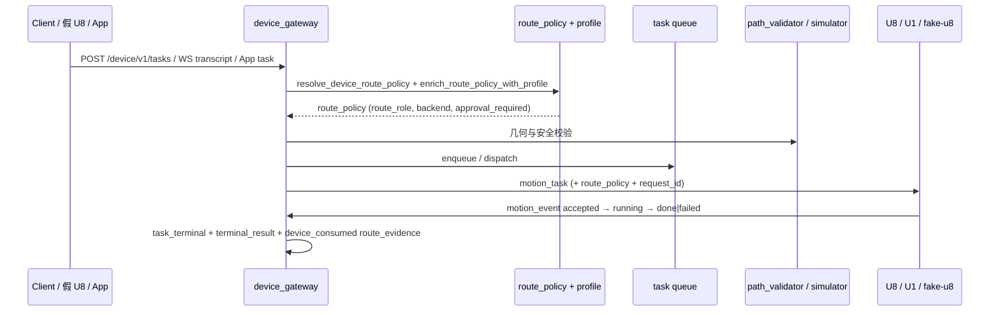

# AI → Motion 发布证据：M15 阶段 5 发布门追踪与终端回放

> **发布日期**：2026-06-24
> **切片 / 里程碑**：M15 AI→Motion stage 5：从用户请求到 `motion_event` 终态/阻断证据的端到端追踪
> **Git commit**：`________`（提交后补填）
> **操作员 / Agent**：Kimi Code CLI
> **环境**：local（Windows 开发机）+ 后续补充 VPS `47.112.162.80`
> **关联路线图**：[`PROJECT_OPTIMIZATION_ROADMAP_CN.md`](../PROJECT_OPTIMIZATION_ROADMAP_CN.md) 阶段 5
> **上一版证据**：[`2026-06-18-M14-draw-generated-async-pipeline.md`](./2026-06-18-M14-draw-generated-async-pipeline.md)

---

## 变更摘要

- **用户可见行为**：设备任务现在携带 `request_id` 与入口标识 (`entrypoint`)，任何 `route_evidence`、`terminal_result` 和 `task_terminal` 事件都可追溯到原始入口（HTTP `/device/v1/tasks`、WebSocket `transcript`、App `/device/v1/app/devices/{id}/tasks` 或阻断路径）。`/device/v1/tasks/{task_id}` 现在直接返回 `terminal_phase` 与 `terminal_result`，便于客户端回放终态。
- **触及模块**：
  - `device_gateway/task_recorder.py`：制品与 JSONL 增加 `request_id` / `entrypoint`。
  - `device_gateway/task_creation_builders.py`、`task_creation_errors.py`：motion_task 与 error task 保留 `entrypoint`。
  - `device_gateway/task_creation.py`：`create_task_from_transcript_async` 支持 `source` / `entrypoint` 覆盖。
  - `device_gateway/tasks.py`：`DeviceTaskRequest` 增加 `source` / `entrypoint`。
  - `device_gateway/task_events.py`：`terminal_result` artifact 确保包含 `device_id`。
  - `routes/device_gateway.py`：HTTP 入口设置 `entrypoint=http_device_tasks`；`GET /tasks/{task_id}` 返回 `terminal_phase` / `terminal_result`。
  - `routes/device_gateway_ws_handlers.py`：WS `transcript` 入口设置 `entrypoint=ws_transcript`。
  - `routes/device_app_tasks.py`：App 入口设置 `entrypoint=app_api`。
  - `tests/device_gateway/test_ai_to_motion_gate.py`：新增 8 条端到端 gate 测试。
- **非目标 / 未改**：未改 U1 运动固件；未改通用聊天/编码热路径；未新增 LLM backend；未改动 `device_artifacts/store.py` 的过滤语义（仅通过确保 `device_id` 存在来兼容现有查询）。

---

## 端到端链路（本切片要证明的路径）



**本切片覆盖的入口**：

- [x] HTTP `POST /device/v1/tasks`
- [x] WebSocket `transcript`
- [x] WebSocket `hello` + 下行 `task_dispatch`
- [x] App `/device/v1/app/devices/{id}/tasks`（文本与结构化两种形态）
- [x] 阻断路径（验证失败 / policy blocked / dispatch blocked / draw_failed）
- [x] 断开重连 → 终态保留

---

## 门 A：服务器健康（部署证据）

| 检查项 | 状态 | 证据 |
|--------|------|------|
| `GET /health` → 200 | ✅ | `curl -sf https://chat.donglicao.com/health` → `{"status":"ok","version":"2.0","model":"lima-1.3"}` |
| `GET /device/v1/health` → 200 | ✅ | `curl -sf https://chat.donglicao.com/device/v1/health` → `{"status":"ok","protocol":"lima-device-v1","production_ready":true}` |
| 无 critical alerts | ✅ | startup phases 全部 `ok`，`error_count=0` |
| 路由引擎 | ✅ | `pytest tests/test_routing_engine.py -q` → 24 passed |
| 设备网关聚焦门 | ✅ | 见下方「聚焦 pytest 命令」→ 34 passed |
| AI→Motion gate 新测试 | ✅ | `pytest tests/device_gateway/test_ai_to_motion_gate.py -q` → 8 passed |

**本地验证命令**（已执行）：

```powershell
python -m pytest tests/device_gateway/test_ai_to_motion_gate.py tests/device_gateway/test_tasks_http.py tests/device_gateway/test_events_http.py tests/test_device_task_service.py tests/test_device_ledger_artifacts.py tests/test_device_gateway_reliability.py -q
# 34 passed

python -m pytest --tb=short -q
# 3553 passed, 17 skipped, 2 deselected

python -m ruff check .
# All checks passed

python -m pyright device_gateway/task_recorder.py device_gateway/task_creation_builders.py device_gateway/task_creation_errors.py device_gateway/task_creation.py device_gateway/tasks.py device_gateway/task_events.py routes/device_gateway_ws_handlers.py routes/device_app_tasks.py routes/device_gateway.py tests/device_gateway/test_ai_to_motion_gate.py
# 0 errors（仅历史 warning）
```

**部署记录**：

- 部署脚本：`python scripts/deploy_unified.py`
- 备份路径：`/opt/lima-router/backups/unified-core-20260624_073501/runtime-before.tgz`
- 重启：`systemctl restart lima-router`
- 回滚命令：恢复上述备份后 `sudo systemctl restart lima-router`

---

## 门 B：设备协议（假 U8 / 假 U1）

| 检查项 | 状态 | 证据 |
|--------|------|------|
| 假 U8 hello 握手 | ✅ | `test_ws_hello_drain_preserves_request_id_and_entrypoint` |
| heartbeat / ack | ✅ | `test_fake_u8_hello_heartbeat_transcript_motion_event_loop`（既有） |
| transcript → 任务创建 | ✅ | `test_ws_transcript_creates_entrypoint_evidence` |
| motion_event 上行 | ✅ | `test_terminal_event_creates_terminal_result_and_device_consumed_evidence` |
| 下行含 `route_policy` | ✅ | `test_ws_hello_drain_preserves_request_id_and_entrypoint` 断言 `motion_task` 含 `route_policy` |
| 断开重连后终态可回放 | ✅ | `test_disconnect_recovery_preserves_terminal_result` |
| 假 U1 运动执行 | ⏳ | 物理固件证据待后续切片补充 |

**协议族**：`lima-device-v1`

---

## 门 C：任务生命周期（按 capability）

| capability | route_role（预期） | 状态 | pytest / 证据 |
|------------|-------------------|------|----------------|
| `home` / 控制 | `device_control` | ✅ | `test_create_and_route_task_records_request_id_and_entrypoint` |
| `write_text` | `device_write` | ✅ | `test_ws_hello_drain_preserves_request_id_and_entrypoint`（write 文本队列） |
| 非法 capability | 阻断 | ✅ | `test_blocking_path_records_route_evidence_with_error_code` |
| 不安全任务 / policy | `dispatch_blocked` | ✅ | 既有 `test_device_gateway_route_policy_validation.py` 套件 |
| WS 断线恢复 | 重连后可继续 | ✅ | `test_disconnect_recovery_preserves_terminal_result` |

**motion_event 生命周期验证**：

```json
{"phase": "accepted"}
{"phase": "running"}
{"phase": "done"}
```

`test_disconnect_recovery_preserves_terminal_result` 在 WS 断开后重连，重新接收 `motion_task`，上报 `accepted → running → done`，最终 `/device/v1/tasks/{task_id}` 返回 `terminal_phase=done` 与 `terminal_result`。

---

## 门 D：路由策略与 Profile

| 检查项 | 状态 | 证据 |
|--------|------|------|
| `route_policy` 全路径保留 | ✅ | `record_route_evidence_artifact` 在成功/失败路径均被调用 |
| 无效组合被拒绝 | ✅ | 既有 `test_device_gateway_route_policy_validation.py` |
| `route_evidence` 制品完整 | ✅ | 含 `route_role`, `backend`, `policy_decision`, `sim_risk_score`, `request_id`, `entrypoint` |
| Profile 不完整 → `approval_required` | ✅ | 既有 `tests/test_device_gateway_profiles.py` |
| `terminal_result` artifact 含 `device_id` | ✅ | `test_terminal_event_creates_terminal_result_and_device_consumed_evidence` |

---

## 门 E：证据与可观测性

| 检查项 | 状态 | 证据 |
|--------|------|------|
| 每个 `task_id` 有唯一终态 | ✅ | `task_snapshot` + `terminal_phase` 字段 |
| 阻断路径产生可查询 evidence | ✅ | `test_blocking_path_records_route_evidence_with_error_code` |
| `device_consumed` evidence 关联终端事件 | ✅ | `record_device_consumed_route_evidence` 在终态触发 |
| 入口可追溯 | ✅ | `entrypoint` 字段：`http_device_tasks` / `ws_transcript` / `app_api` |
| 请求可关联 | ✅ | `request_id` 贯穿 `motion_task`、`route_evidence`、`terminal_result` |

---

## 门 F：代码质量

| 检查项 | 状态 | 证据 |
|--------|------|------|
| 全量 pytest 通过 | ✅ | 3553 passed / 17 skipped / 2 deselected |
| ruff check 通过 | ✅ | `ruff check .` clean |
| pyright 修改文件 0 errors | ✅ | 0 errors（历史 warning 未引入新错误） |
| 无新增 >300 行文件 | ✅ | `scripts/check_code_size.py` 通过 |
| 无新增 >50 行生产函数 | ✅ | 同上 |

---

## 已知限制与后续工作

1. **物理设备证据**：本切片仅覆盖云端/假 U8 端到端追踪；真实 U8/U1 执行证据需在 `esp32S_XYZ` 子模块补充。
2. **JSONL 持久化**：`route_evidence_{device_id}.log` 仍为本地 JSONL，未进入持久 artifact store；当前通过 `artifact_store` 的 `route_evidence` 制品已可查询。
3. **App 结构化任务入口**：文本路径已设置 `entrypoint=app_api`；结构化 capability 路径同样通过 `_build_app_gateway_task` 设置入口。
4. **发布报告生成器**：当前为手动文档；后续可考虑从 `ledger_store` + `artifact_store` 自动生成。

---

## 晋升规则

- 仅当门 A–F 全部勾选且 VPS 冒烟证据补充后，本切片方可宣布生产就绪。
- 下一里程碑（M16）建议：在真实假 U8 / 模拟器上复跑本门，并补充物理设备 `motion_event` 证据。
