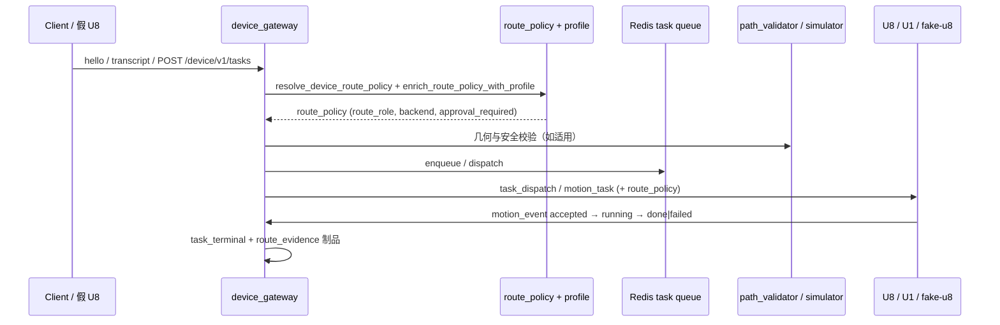

# AI → Motion 发布证据（填写模板）

> **用法**：复制本文件为 `docs/release_evidence/YYYY-MM-DD-<切片名>.md`，按门 A–F 填写。
> **权威清单**：[`docs/RELEASE_GATE_CHECKLIST.md`](../RELEASE_GATE_CHECKLIST.md)
> **参考样例**：[`2026-06-12-phase1-5-complete.md`](./2026-06-12-phase1-5-complete.md)
>
> **原则**：健康的 VPS ≠ 安全的运动。部署证据与硬件证据分开记录；任一 P0 门未通过不得宣称生产可发布。

---

## 元数据

| 字段 | 值 |
|------|-----|
| 发布日期 | YYYY-MM-DD |
| 切片 / 里程碑 | （例：M13、route_policy profile 接入、固件 edge_c 升级） |
| Git commit | `________` |
| 操作员 / Agent | |
| 环境 | `local` / `staging` / `production` |
| 关联路线图 | [`PROJECT_OPTIMIZATION_ROADMAP_CN.md`](../PROJECT_OPTIMIZATION_ROADMAP_CN.md) 阶段 ___ |
| 上一版证据 | `docs/release_evidence/________.md` |

## 变更摘要

- **用户可见行为**：（例：语音「画一个圆」→ 生成路径 → 设备执行）
- **触及模块**：（例：`device_gateway/task_creation.py`、`routes/device_gateway_ws_handlers.py`）
- **非目标 / 未改**：（例：未改 U1 固件、未改聊天热路径）

## 端到端链路（本切片要证明的路径）



**本切片覆盖的入口**（勾选）：

- [ ] HTTP `POST /device/v1/tasks`
- [ ] WebSocket `transcript`
- [ ] WebSocket `hello` + 下行 `task_dispatch`
- [ ] Edge-C `motion_task`（`esp32s_adapter`）
- [ ] 其他：________

---

## 门 A：服务器健康（部署证据）

| 检查项 | 状态 | 证据 |
|--------|------|------|
| `GET /health` → 200 | ⬜ | `curl -sf https://chat.donglicao.com/health` 输出 / 截图 |
| `GET /device/v1/health` → 200 | ⬜ | 同上 |
| 无 critical alerts | ⬜ | `/v1/ops/summary` 或 Prometheus 截图 |
| 路由引擎 | ⬜ | `pytest tests/test_routing_engine.py -q` → ___ passed |
| 设备网关聚焦门 | ⬜ | 见下方「聚焦 pytest 命令」→ ___ passed |

**部署记录**（若本切片含 VPS 发布）：

- 部署脚本：`python scripts/deploy_unified.py`
- 备份路径：`/opt/lima-router/backups/________`
- 回滚命令：（填写）

---

## 门 B：设备协议（假 U8 / 假 U1）

| 检查项 | 状态 | 证据 |
|--------|------|------|
| 假 U8 hello 握手 | ⬜ | `test_fake_u8_hello_heartbeat_transcript_motion_event_loop` |
| heartbeat / ack | ⬜ | 同上或 WS 日志片段 |
| transcript → 任务创建 | ⬜ | `task_created` 事件 / JSONL |
| motion_event 上行 | ⬜ | `motion_event_ack` + phase 序列 |
| 下行含 `route_policy` | ⬜ | `motion_task` / `task_dispatch` 抓包或测试断言 |
| 假 U1 运动执行 | ⬜ | 测试名 / 工具：________（未实现则标 ⏳） |

**协议族**：`lima-device-v1` / Edge-C — 本切片：________

---

## 门 C：任务生命周期（按 capability）

| capability | route_role（预期） | 状态 | pytest / 证据 |
|------------|-------------------|------|----------------|
| `home` / 控制 | `device_control` | ⬜ | `test_control_command_uses_no_model_route` |
| `write_text` | `device_write` | ⬜ | `test_write_text_uses_device_write_route` |
| `draw_generated` | `device_draw` | ⬜ | `test_generated_drawing_uses_device_draw_route` |
| SVG / `run_path` | `device_vector` | ⬜ | `test_svg_like_generated_drawing_uses_vector_route_without_model` |
| 非法 role / policy | 拒绝或阻断 | ⬜ | `test_validate_route_policy_rejects_unknown_role` |
| 不安全任务 | `dispatch_blocked` | ⬜ | `test_policy_blocks_unsafe_task` |
| WS 断线恢复 | 重连后可继续 | ⬜ | 测试名 / 手动步骤 |

**motion_event 生命周期**（必需：`accepted` + `running`；终态：`done`/`failed`/…）：

```
（粘贴 phase 序列或 JSONL 片段）
```

---

## 门 D：路由策略与 Profile

| 检查项 | 状态 | 证据 |
|--------|------|------|
| `route_policy` 全路径保留 | ⬜ | `test_route_policy_matrix_for_hot_device_families` |
| 无效组合被拒绝 | ⬜ | route_policy 验证测试套件 |
| `route_evidence` 制品完整 | ⬜ | 含 `route_role`, `policy_decision`, `sim_risk_score` |
| Profile 不完整 → `approval_required` | ⬜ | `test_device_gateway_profiles.py` 相关用例 |
| 固件不兼容 → 阻断 | ⬜ | `test_fw_incompatible_blocks_task_creation` |
| `backend` 字段与 `model_routing` 一致 | ⬜ | `test_route_policy_backend_field.py` |

**本切片 route_policy 样例**（脱敏）：

```json
{
  "route_role": "device_draw",
  "backend": "dashscope_wanx",
  "approval_required": false
}
```

---

## 门 E：安全与几何

| 检查项 | 状态 | 证据 |
|--------|------|------|
| 设备安全策略 | ⬜ | `pytest tests/test_device_gateway_protocol.py -q` |
| 路径越界拒绝 | ⬜ | `pytest tests/test_device_gateway_path_validator.py -q` |
| 未知设备保守 profile | ⬜ | `test_unknown_device_gets_conservative_profile` |
| 高风险需审批 | ⬜ | `test_high_risk_task_requires_approval` |
| 无静默降级（AGENTS.md #0） | ⬜ | 相关路径 `logger.warning` 片段 / 代码审查 |

---

## 门 F：可观测性

| 检查项 | 状态 | 证据 |
|--------|------|------|
| 路由决策事件 | ⬜ | `agent_events` 样例 |
| 设备账本事件 | ⬜ | `task_created`, `task_dispatched`, `motion_event`, `task_terminal` |
| `route_evidence` 可查询 | ⬜ | `GET /device/v1/devices/{id}/history?artifact_type=route_evidence` |
| 指标 / 日志可关联 `task_id` | ⬜ | correlation_id 或 task_id 日志行 |

---

## 聚焦 pytest 命令（复制执行）

```powershell
# 门 C + 门 D 核心
python -m pytest tests/test_device_gateway_model_routing.py -q

# 门 B 假 U8 环
python -m pytest tests/test_device_gateway_routes.py::test_fake_u8_hello_heartbeat_transcript_motion_event_loop -q

# 门 E + Profile
python -m pytest tests/test_device_gateway_protocol.py tests/test_device_gateway_path_validator.py tests/test_device_gateway_profiles.py -q

# 路由引擎（门 A）
python -m pytest tests/test_routing_engine.py -q
```

**本切片结果**：

```
（粘贴 pytest 摘要，例：33 passed, 0 failed）
```

---

## 物理设备证据（可选，生产发布必填）

> 假 U8 通过不能替代真机。发布到生产前至少记录一次真机或台架运行。

### 设备信息

| 项 | 值 |
|----|-----|
| 板型 / 子模块 commit | |
| U8 固件版本 | |
| U1 固件版本 | |
| 工作区 (mm) | |
| 材料 / 笔型 | |

### 运行记录

| 项 | 值 |
|----|-----|
| 输入（语音/文本/任务 JSON） | |
| 生成物 hash (SHA-256) | |
| 路径点数 | |
| 终端 phase | `done` / `failed` |
| 实际耗时 (s) | |
| 操作员备注 | |

---

## 发布决策

| 维度 | 结论 | 说明 |
|------|------|------|
| 门 A 部署 | ⬜ 通过 / ⬜ 失败 | |
| 门 B–F 自动化 | ⬜ 通过 / ⬜ 部分 / ⬜ 失败 | |
| 物理设备 | ⬜ 通过 / ⬜ 未测 / ⬜ N/A | |
| **总体建议** | ⬜ 可发布生产 / ⬜ 仅测试环境 / ⬜ 阻塞 | |

**阻塞项（P0）**：

1.
2.

**回滚方案**：

-

---

## 归档检查

- [ ] `STATUS.md` 已更新（若里程碑级）
- [ ] `progress.md` 已附本文件链接与 pytest 摘要
- [ ] `docs/LIMA_MEMORY_CN.md` 已记录跨会话事实（若有）
- [ ] 仅 stage 本切片相关文件后 commit
